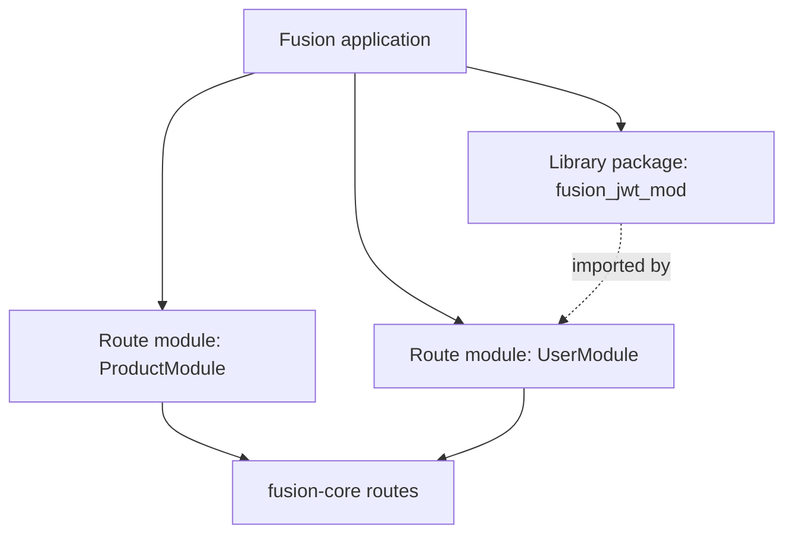
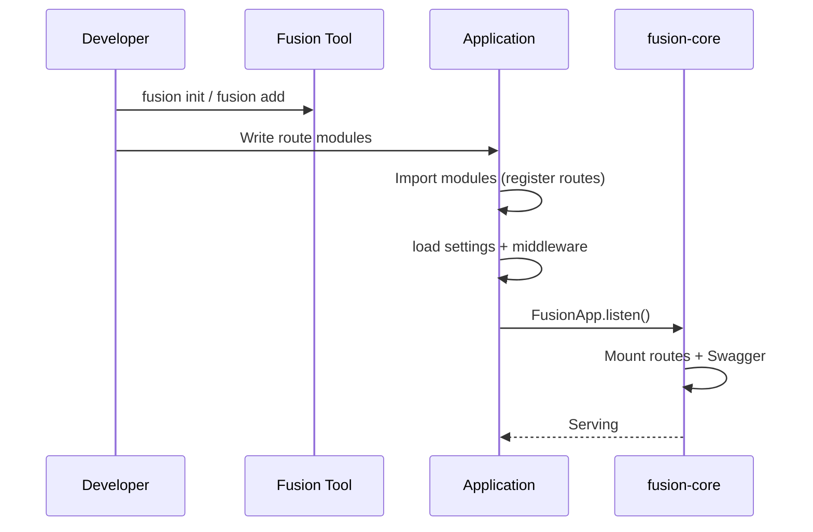

## What

**FMA (Fusion Module Architecture)** is the way Fusion structures backend applications:

1. **Route modules** — class-based HTTP APIs (`FusionBaseApi` + route registration)
2. **Library packages** — publishable, installable packages (`fusion module init` / `fusion add`)
3. **Shared Rust core** — one engine for routing and HTTP semantics across languages

FMA is not a separate runtime or plugin host. It is an architectural convention enforced by project layout, naming, CLI packaging, and the class-based routing model.

## Why

Without clear module boundaries, backends tend to grow into a single package where routes, helpers, and side effects mix freely. FMA aims to:

- Keep each HTTP resource surface in one place (a route module class)
- Allow reusable logic to ship as normal packages (not framework-specific plugins)
- Keep language bindings interchangeable on the same core semantics
- Make registration explicit (import / register) so startup is predictable

## How — two module kinds



| Kind | What it is | How you create it | How the app uses it |
| --- | --- | --- | --- |
| **Route module** | `FusionBaseApi` subclass with HTTP handlers | Hand-written under `src/modules/...` (or scaffolded by `fusion init`) | Import the file in `main` so `@route` runs; handlers mount on listen |
| **Library package** | Ordinary Python / TS / Rust package with `fusion.module.toml` | `fusion module init` | `fusion add --github ...` then `import` / `require` like any dependency |

These are **different concepts**. Do not confuse “module” in route class names (`ProductModule`) with CLI library packages (`fusion_jwt_mod`).

## Design principles

### 1. Explicit registration

Route modules register when their defining module is imported (Python/Node decorators) or when you call `Route.Register` (C#). Fusion does not scan directories for classes at runtime.

### 2. Resource ownership

A route module typically owns one resource path stem via `[module]` (e.g. `ProductModule` → `product`). Convention handlers (`get` / `post` / …) and optional custom HTTP routes (`@http_get` … `@http_options`, …) live on that class.

### 3. Packages are libraries

CLI modules are **not** auto-mounted routes. After `fusion add`, you import functions/classes and call them from your route modules, middleware, or startup code.

### 4. Dependency direction

Recommended direction:

```text
Application entry
  → route modules
    → library packages / shared helpers
      → fusion-framework binding
        → fusion-core
```

Route modules should not import each other’s internal helpers casually. Prefer extracting shared code into a library package or a small shared app folder.

### 5. Isolation of HTTP surface

Keep HTTP concerns (status codes, response envelopes, path params) in route modules. Keep reusable domain helpers in library packages when they are meant to be shared across apps.

## Module boundaries

### Route module — belongs inside

- HTTP handlers (`get`, `post`, `@http_get` … `@http_options`, …)
- Request/response mapping for that resource
- Route-scoped middleware / roles for that resource
- Swagger metadata for those operations

### Route module — does not belong inside

- Process-wide startup (`listen()`, loading all settings) — keep in entrypoint
- Unrelated resources (split into another class)
- Heavy reusable libraries that other apps need — extract a package

### Library package — belongs inside

- Pure functions / classes your apps import
- Optional native Rust core with PyO3 / N-API bindings (when using Rust scaffolds)
- `fusion.module.toml` metadata and build steps

### Library package — does not belong inside

- Assuming a specific app’s `main.py` layout
- Registering global routes unless the package documents an explicit “call this register function” API

## Lifecycle (conceptual)



Details: [Application lifecycle](./lifecycle).

## Inter-module communication

Fusion has **no built-in message bus or service locator**. Modules communicate by:

| Mechanism | Typical use |
| --- | --- |
| **Python/TS/C# imports** | Route module A imports helpers from a library package |
| **HTTP** | External clients (or another service) call route modules |
| **Request state** | Middleware writes `request.state`; handlers read it (e.g. JWT payload) |
| **Shared settings** | Both read `fusion.<env>.json` / settings façade |

There is **no** framework DI container and **no** automatic inter-module RPC.

## Public vs internal APIs

| Surface | Guidance |
| --- | --- |
| Route paths | Public HTTP API — version with `version=` when needed |
| Library package `__init__` / exports | Public import API for consumers |
| Private helpers | Prefix or keep in internal modules; do not import across route modules without extracting a package |

## Configuration inside modules

- **App-wide:** `fusion.<env>.json` (+ Python `core/settings.py` overlay)
- **Route module:** Swagger/route options on `@route` / `[Route]`
- **Library package:** its own config conventions (document them in the package README) — Fusion does not inject package config automatically

## Routing inside modules

See [Application route modules](./application-modules) and language guides:

- [Python Router](../../python/v1/router)
- [TypeScript Router](../../typescript/v1/router)
- [C# Router](../../csharp/v1/router)

## Versioning

| What | How |
| --- | --- |
| HTTP API versions | `@route(..., version="v1")` → path prefix + separate OpenAPI specs |
| Library packages | Semver in `fusion.module.toml` / package manifests; install with `@v1.0.0` refs via CLI |
| Framework packages | PyPI/npm `fusion-framework`, NuGet `Fusion-Framework` (currently **1.2.6** in the framework repo) |

## Circular dependencies

FMA does not provide a special cycle breaker. Avoid:

- Route module A importing route module B’s private helpers and vice versa
- Library packages that import application entrypoints

Extract shared code downward into a third package or shared folder.

## Naming conventions

| Kind | Convention |
| --- | --- |
| Route class | `SomethingModule` (optional but enables clean `[module]` stems) |
| App folder | `src/modules/<name>/` (scaffold default) |
| Library package id | Recommended `fusion_<name>_mod` (Python) / `fusion-<name>-mod` (npm) — see [CLI Modules](../../cli/v1/modules) |

## Recommended composition

```text
my-app/
├── main.py
├── fusion.dev.json
├── core/settings.py
└── src/modules/
    ├── products/products.py    # route module
    └── users/users.py          # route module

# separate repo
fusion-jwt-mod/                 # library package
├── fusion.module.toml
└── ...
```

## Anti-patterns (FMA-specific)

See [Anti-patterns](./anti-patterns) for full list. Short version:

- Treating library packages as auto-mounted route plugins
- One giant `AppModule` with unrelated handlers
- Putting `FusionApp.listen()` inside every route file
- Cross-importing route modules instead of extracting a package

## Next steps

- [Application route modules](./application-modules)
- [Reusable packages](./packages)
- [Project structure](./project-structure)
