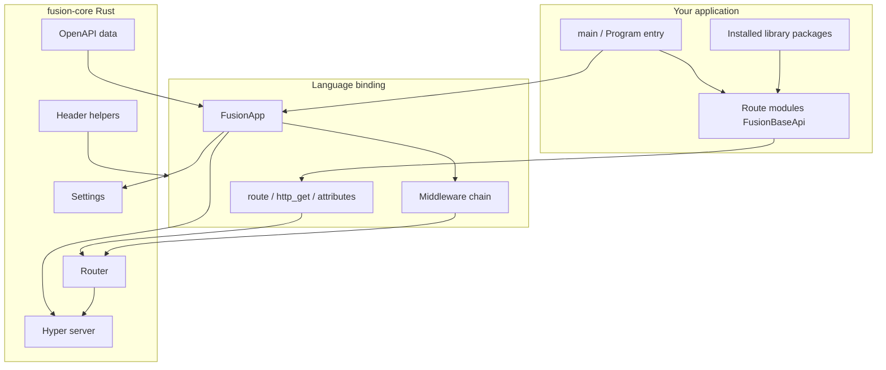

## What Fusion is

**Fusion Framework** is a class-based HTTP framework. You define API modules as classes (`FusionBaseApi` subclasses), register them with a route decorator or attribute, and start a `FusionApp`. A shared **Rust core** (`fusion-core`) owns HTTP serving, routing, settings, header helpers, and response serialization. Language bindings (Python, TypeScript/Node.js, C#) stay thin and focus on developer experience.

Current published version of the framework packages: **1.2.3** (see the [fusion-framework](https://github.com/cipherunits/fusion-framework) repository).

## Design philosophy

| Principle | What it means in practice |
| --- | --- |
| Shared core | Path tokens, settings, status codes, and header helpers are implemented once in Rust |
| Class-based APIs | Handlers live on classes, not free functions — a module owns a resource surface |
| Thin bindings | Python / Node / C# mirror the same HTTP semantics with idiomatic syntax |
| Explicit registration | Importing a route module (or calling `Route.Register`) registers it; there is no magic auto-discovery scan of the filesystem |
| Composable packages | Reusable libraries are ordinary packages installed via Fusion Tool (`fusion add`) |

## High-level architecture

## Layers you will work with

| Layer | Responsibility |
| --- | --- |
| **Application** | `main.py` / entry file, environment JSON, middleware list, importing modules |
| **Route module** | A `FusionBaseApi` class with `@route` / `route()` / `[Route]` — owns HTTP handlers for a resource |
| **Library package** | A publishable package created with `fusion module init` and installed with `fusion add` — plain importable code, not a special runtime plugin type |
| **Binding** | Language-specific API over the Rust core |
| **fusion-core** | HTTP server, router, settings, naming tokens, fingerprints, serialization |

## FMA (Fusion Module Architecture)

FMA is Fusion’s modularity model: applications are composed of **route modules** and optional **reusable packages**, with a clear boundary between HTTP surface and shared libraries.

→ Deep dive: [Fusion Module Architecture (FMA)](./fma)

## Learning path

1. [What Fusion is not](./what-fusion-is-not) — scope boundaries (no ORM, no DI container, …)
2. [Project structure](./project-structure) — what `fusion init` creates
3. Language getting started: [Python](../../python/v1/getting-started) · [TypeScript](../../typescript/v1/getting-started) · [C#](../../csharp/v1/getting-started)
4. [Application route modules](./application-modules)
5. [Reusable packages](./packages) · [CLI Modules](../../cli/v1/modules)
6. [Application lifecycle](./lifecycle) · [Request lifecycle](./request-lifecycle)
7. [Best practices](./best-practices) · [Anti-patterns](./anti-patterns)

## Related tooling

- **[Fusion Tool](../../cli/v1)** — scaffold apps, environments, commands, package modules
- **[Fusion Desktop](https://fusion.cipherunit.xyz/en/gui)** — GUI for managing Fusion backends
