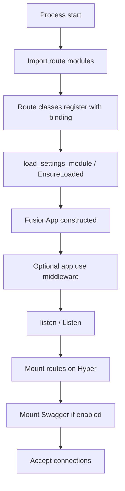
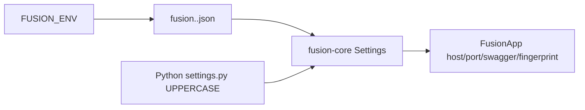

## What

The **application lifecycle** is the ordered sequence of steps from starting your process to serving HTTP traffic.

## Startup sequence

### Step details

| Step | What happens |
| --- | --- |
| Import / register | Python/Node: decorators run at import. C#: `Route.Register<T>()` |
| Settings | Load `fusion.<env>.json` (`FUSION_ENV`, default `dev`). Python may merge UPPERCASE attrs from `settings` / `core.settings` |
| `FusionApp` | Holds settings, middleware list, native engine handle |
| Middleware | Global chain prepared (see binding notes on `framework_headers`) |
| `listen` | Binding mounts registered routes, optional Swagger routes, binds host/port, blocks serving |

## Settings flow

If the JSON has a top-level `config` object (CLI scaffold style), that object is merged as settings. Otherwise top-level keys (except `env` / `commands`) are merged.

## Shutdown

`listen()` typically blocks until the process is terminated. There is no separate Fusion “graceful shutdown API” documented beyond normal process signals — treat OS signal handling as application responsibility unless your binding exposes dispose/`using` patterns (C# `FusionApp` is `IDisposable`).

## Next

- [Settings and configuration](./settings) — `fusion.<env>.json`, `FUSION_ENV`, overlays
- [Request lifecycle](./request-lifecycle)
- Language Config: [Python](../../python/v1/config) · [TypeScript](../../typescript/v1/config) · [C#](../../csharp/v1/config)
