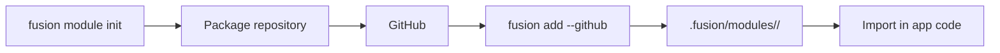

## What

A **Fusion library package** (often called a “module” in the CLI) is a publishable library with a `fusion.module.toml` manifest. It is installed into an application with `fusion add` and consumed via normal language imports.

It is **not** automatically mounted as HTTP routes.

## Why

Reuse middleware helpers, validators, clients, or native code across many Fusion apps without copying files.

## How

Full CLI reference: [Modules](../../cli/v1/modules).



### Create

```bash
fusion module init --lang python --name jwt --description "JWT helpers"
```

### Install into an app

From a project that has `fusion-framework.toml`:

```bash
fusion add --github OWNER/fusion-jwt-mod@v1.0.0
```

### Use

```python
from fusion_jwt_mod import some_helper
```

Call helpers from route modules, middleware, or startup — whatever fits your design.

## Application module vs reusable package

| | Route module | Library package |
| --- | --- | --- |
| Lives in | Application repo (`src/modules`) | Separate repo (recommended) |
| Registers HTTP routes? | Yes | Only if *you* write code that registers them |
| Install mechanism | Git / app source | `fusion add` + import |
| Manifest | None required | `fusion.module.toml` |

## Best practices

- Keep packages focused (one concern)
- Document public exports in the package README
- Version with tags for `fusion add …@vX.Y.Z`
- Prefer Rust scaffolds when one native core must serve Python and Node hosts

## See also

- [FMA](./fma)
- [CLI Modules](../../cli/v1/modules)
