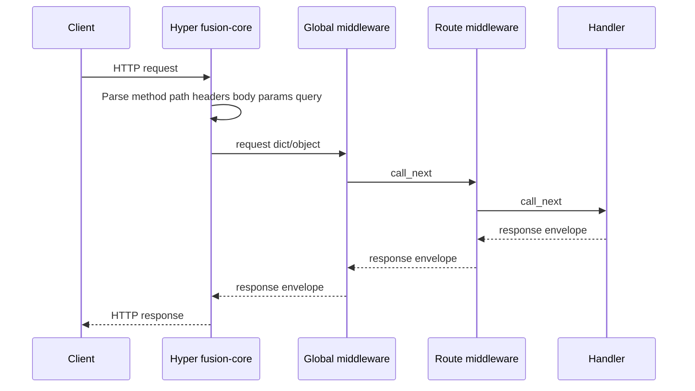

## Pipeline



## Request fields

| Field | Meaning |
| --- | --- |
| `method` | HTTP verb |
| `path` | Request path |
| `headers` | Header map |
| `body` | Raw body string |
| `params` | Path parameters |
| `query` | Query string map |
| `state` | Mutable bag for middleware (e.g. JWT) |

## Response envelope

Handlers return (or middleware short-circuits with) an object shaped like:

```json
{ "status": 200, "body": { }, "headers": { } }
```

Use `self.response(...)` / `Response(...)` helpers. Non-string bodies are JSON-serialized by the core when appropriate.

## Middleware order

1. Global middleware registered on `FusionApp` (outer first)
2. Route middleware from `@route(..., middleware=...)` / `roles=...`
3. Handler

Returning `{ "status": …, "body": … }` stops the chain.

## Python parameter binding

On Python only, handler **signature parameters** are filled from path → body (for write methods) → query. This is **not** a dependency-injection container. Node and C# expose `params` / `query` / `body` on the request object instead.

## Fingerprint headers

When enabled, Fusion may attach identity headers such as `X-Powered-By`, `X-Framework`, and `X-Fusion-Version` (middleware and/or server layer depending on binding and `fingerprint.enabled`). See language middleware guides.
