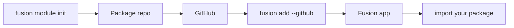

## Overview

Fusion **modules** are publishable library packages — not route plugins.
You write a normal package (Python, TypeScript, or Rust), push it to GitHub, then install it into a Fusion app with the CLI. After that, import it like any other dependency.



## Recommended naming

Naming is **recommended**, not required. You can override it in `fusion.module.toml`.

| Host | Pattern | Example (`--name jwt`) |
| --- | --- | --- |
| Python | `fusion_<name>_mod` | `fusion_jwt_mod` → `from fusion_jwt_mod import ...` |
| npm / TypeScript | `fusion-<name>-mod` | `fusion-jwt-mod` → `import { ... } from "fusion-jwt-mod"` |

Repo / folder default: `fusion-<name>-mod`.

## Create a module

```bash
fusion module init
```

Interactive prompts ask for:

1. Implementation language — **Python**, **TypeScript**, **C#**, or **Rust**
2. Module name (id)
3. Description
4. Output directory (interactive default `fusion-{id}-mod`)

Non-interactive:

```bash
fusion module init --lang python --name example --description "My first module"
fusion module init --lang csharp --name helpers --description "Shared helpers"
fusion module init --lang rust --name auth --description "Auth helpers" ./fusion-auth-mod
```

### Languages

| Language | What you get |
| --- | --- |
| **Python** | Pure Python package under `python/fusion_<name>_mod/` |
| **TypeScript** | npm package with `js/` + `src/` |
| **C#** | .NET library package (`Fusion<Name>Mod` style) |
| **Rust** | Shared Rust core + optional **PyO3**, **N-API**, and **C#** host targets |

Rust is useful when you want one native core for multiple host languages. Non-interactive `--lang rust` enables all three host targets; interactive mode lets you multi-select.

### Scaffold layout (Python)

```text
fusion-example-mod/
├── fusion.module.toml
├── pyproject.toml
├── README.md
└── python/
    └── fusion_example_mod/
        ├── __init__.py
        └── hello.py
```

The scaffold includes a small `hello()` example. Replace it with your own API.


## What each language scaffold creates

### Python (`--lang python`)

Creates a **pure Python** installable package:

```text
fusion-<id>-mod/
├── fusion.module.toml
├── pyproject.toml          # setuptools, package under python/
├── README.md
├── .gitignore
└── python/
    └── fusion_<id>_mod/
        ├── __init__.py     # exports hello()
        └── hello.py
```

- Package name: `fusion_<id>_mod` (underscores)
- Build on `fusion add`: `pip install -e .`
- Host target: Python apps only
- You replace `hello()` with your public API; apps `from fusion_<id>_mod import …`

### TypeScript (`--lang typescript`)

Creates an **npm** package with TypeScript source compiled to `js/`:

```text
fusion-<id>-mod/
├── fusion.module.toml
├── package.json            # name: fusion-<id>-mod, build: tsc
├── tsconfig.json
├── src/index.ts            # hello()
├── js/index.js + index.d.ts
├── README.md
└── .gitignore
```

- Package name: `fusion-<id>-mod`
- Build: `npm install && npm run build`
- Host target: TypeScript/Node Fusion apps
- After `fusion add`, CLI links `file:.fusion/modules/<id>` into the app `package.json`

### C# (`--lang csharp`)

Creates a **.NET class library** (`net10.0`):

```text
fusion-<id>-mod/
├── fusion.module.toml
├── Fusion<Name>Mod/
│   ├── Fusion<Name>Mod.csproj
│   └── Module.cs           # Module.Hello()
├── README.md
└── .gitignore
```

- Package / assembly: `Fusion<Name>Mod` (PascalCase from id)
- Build: `dotnet build -c Release …`
- Host target: C# Fusion apps
- After `fusion add`, CLI runs `dotnet add reference` to the vendored `.csproj`

### Rust (`--lang rust`)

Creates a **Cargo workspace** with a shared Rust core and optional host bindings:

```text
fusion-<id>-mod/
├── fusion.module.toml
├── Cargo.toml              # workspace
├── crates/core/            # shared Rust library (hello)
├── bindings/python/        # optional PyO3 (if Python target selected)
├── bindings/node/          # optional N-API (if TypeScript target selected)
├── bindings/csharp/        # optional P/Invoke wrapper (if C# target selected)
├── README.md
└── .gitignore
```

- Interactive mode: multi-select which hosts to enable (Python / TypeScript / C#)
- Non-interactive `--lang rust`: **all three** hosts enabled by default
- Build: `cargo build --release` plus per-host steps (`maturin`, `npm run build`, `dotnet build`) declared in `fusion.module.toml`
- Use Rust when one native implementation must serve multiple language hosts

## After scaffold — publish & install flow

1. Implement your API (replace `hello` / `Module.Hello`)
2. Push to GitHub and tag versions (`v1.0.0`)
3. In a Fusion **app** directory: `fusion add --github OWNER/REPO@v1.0.0`
4. Import the package in route modules / middleware — **routes are not auto-mounted**

## `fusion.module.toml` fields that matter

| Section | Purpose |
| --- | --- |
| `[module]` | `id`, `name`, `version`, `description` |
| `[module.impl]` | `language` = `python` \| `typescript` \| `csharp` \| `rust` |
| `[module.targets]` | Which host apps can install this module |
| `[module.entry]` | Import / package names per host |
| `[module.build]` | Shell commands `fusion add` runs after vendor |

ID rules: lowercase letters, digits, hyphens; must start with a letter.

## Manifest

Every module ships `fusion.module.toml`:

```toml
[module]
id = "example"
name = "example"
version = "0.1.0"
description = "My first module"

[module.impl]
language = "python"

[module.targets]
python = true
typescript = false

[module.entry]
python = "fusion_example_mod"

[module.build]
python = "pip install -e ."
```

- **`entry`** — import package name (or npm package name for TypeScript)
- **`build`** — commands `fusion add` runs after download
- **`targets`** — which host app languages this module supports

## Publish

1. Implement your package
2. Commit and push to GitHub
3. From a Fusion app, run `fusion add`

## Install into an app

Run this from a project that already has `fusion-framework.toml`:

```bash
fusion add --github cipherunits/hello-fusion
fusion add --github OWNER/fusion-example-mod@v1.0.0
fusion add --github https://github.com/OWNER/fusion-example-mod
```

The CLI will:

1. Download the repository
2. Validate `fusion.module.toml`
3. Vendor it under `.fusion/modules/<id>/`
4. Run the declared build / install steps (`pip install -e .`, `maturin`, or `npm`)
5. Record the module in `fusion-framework.toml` under `[[modules]]`
6. For TypeScript hosts, link the package in `package.json`

## Use it in your app

Python:

```python
from fusion_example_mod import hello

print(hello("world"))
```

TypeScript:

```ts
import { hello } from "fusion-example-mod";

console.log(hello("world"));
```

Call your functions from routes, services, or anywhere else in the Fusion app — modules are plain libraries.
