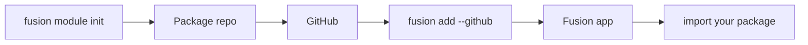

## Overview

Fusion **modules** are publishable library packages — not route plugins.
You write a normal package (Python, TypeScript, or Rust), push it to GitHub, then install it into a Fusion app with the CLI. After that, import it like any other dependency.



## Recommended naming

Naming is **recommended**, not required. You can override it in `fusion.module.toml`.

| Host | Pattern | Example (`--name jwt`) |
| --- | --- | --- |
| Python | `fusion_<name>_mod` | `fusion_jwt_mod` → `from fusion_jwt_mod import ...` |
| npm / TypeScript | `fusion-<name>-mod` | `fusion-jwt-mod` → `import { ... } from "fusion-jwt-mod"` |

Repo / folder default: `fusion-<name>-mod`.

## Create a module

```bash
fusion module init
```

Interactive prompts ask for:

1. Implementation language — **Python**, **TypeScript**, or **Rust**
2. Module name (id)
3. Description
4. Output directory (default `fusion-<id>-mod`)

Non-interactive:

```bash
fusion module init --lang python --name example --description "My first module"
fusion module init --lang rust --name auth --description "Auth helpers" ./fusion-auth-mod
```

### Languages

| Language | What you get |
| --- | --- |
| **Python** | Pure Python package under `python/fusion_<name>_mod/` |
| **TypeScript** | npm package with `js/` + `src/` |
| **Rust** | Shared Rust core + optional **PyO3** and **N-API** bindings so one module can target Python and TypeScript hosts |

Rust is useful when you want one native core for every host language.

### Scaffold layout (Python)

```text
fusion-example-mod/
├── fusion.module.toml
├── pyproject.toml
├── README.md
└── python/
    └── fusion_example_mod/
        ├── __init__.py
        └── hello.py
```

The scaffold includes a small `hello()` example. Replace it with your own API.

## Manifest

Every module ships `fusion.module.toml`:

```toml
[module]
id = "example"
name = "example"
version = "0.1.0"
description = "My first module"

[module.impl]
language = "python"

[module.targets]
python = true
typescript = false

[module.entry]
python = "fusion_example_mod"

[module.build]
python = "pip install -e ."
```

- **`entry`** — import package name (or npm package name for TypeScript)
- **`build`** — commands `fusion add` runs after download
- **`targets`** — which host app languages this module supports

## Publish

1. Implement your package
2. Commit and push to GitHub
3. From a Fusion app, run `fusion add`

## Install into an app

Run this from a project that already has `fusion-framework.toml`:

```bash
fusion add --github cipherunits/hello-fusion
fusion add --github OWNER/fusion-example-mod@v1.0.0
fusion add --github https://github.com/OWNER/fusion-example-mod
```

The CLI will:

1. Download the repository
2. Validate `fusion.module.toml`
3. Vendor it under `.fusion/modules/<id>/`
4. Run the declared build / install steps (`pip install -e .`, `maturin`, or `npm`)
5. Record the module in `fusion-framework.toml` under `[[modules]]`
6. For TypeScript hosts, link the package in `package.json`

## Use it in your app

Python:

```python
from fusion_example_mod import hello

print(hello("world"))
```

TypeScript:

```ts
import { hello } from "fusion-example-mod";

console.log(hello("world"));
```

Call your functions from routes, services, or anywhere else in the Fusion app — modules are plain libraries.
