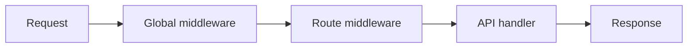

## Overview

Middleware wraps every request (or a single route) as:

```text
(request, call_next) → response | call_next(request)
```

**Fusion ships with no default middleware.** Nothing runs until you register callables yourself — typically in `main.py`.

Helpers like `bearer_jwt` / `require_roles` are optional utilities. You must `app.use(...)` or pass them to `@route` yourself.

## Two layers



1. **Global** — registered on `FusionApp` via `app.use(...)` (from `MIDDLEWARE` in `main.py`)
2. **Route** — passed as `middleware=[...]` or `roles=[...]` on `@route`

Order: global list first (outer → inner), then route list, then the handler.

## Register in `main.py`

```python
"""Entry point: register routes, middleware, and start the server."""

import src.modules.products.products  # registers @route classes

from fusion_framework.app import FusionApp
from fusion_framework.config import get_settings, load_settings_module

# Global middleware (optional). Framework ships with none by default.
MIDDLEWARE: list = []


def main() -> None:
    load_settings_module("settings")
    app = FusionApp(get_settings())
    for middleware in MIDDLEWARE:
        app.use(middleware)
    app.listen()


if __name__ == "__main__":
    main()
```

Add your functions to `MIDDLEWARE`:

```python
def logging_middleware(request, call_next):
    print(request["method"], request["path"])
    return call_next(request)

MIDDLEWARE = [logging_middleware]
```

## Write a simple middleware

```python
def require_api_key(request, call_next):
    key = (request.get("headers") or {}).get("x-api-key")
    if key != "secret":
        return {"status": 401, "body": {"detail": "invalid api key"}}
    return call_next(request)
```

| Action | How |
| --- | --- |
| Continue | `return call_next(request)` |
| Stop early | `return {"status": 401, "body": {...}}` |
| Share data | `request.setdefault("state", {})["user"] = ...` then `call_next` |

Inside a handler, read state with `self.state`:

```python
def get(self):
    user = self.state.get("user")
    return self.response({"user": user})
```

## Route-level middleware

```python
from fusion_framework.route import route

def only_post(request, call_next):
    if request.get("method", "").upper() != "POST":
        return {"status": 405, "body": {"detail": "POST only"}}
    return call_next(request)

@route("api/[module]/", middleware=[only_post])
class UploadModule(FusionBaseApi):
    def post(self):
        return self.response({"ok": True})
```

## Optional helpers

These are **not** auto-enabled.

### `bearer_jwt()`

Reads `Authorization: Bearer …`, decodes the JWT payload (default: **unverified** base64 decode — pass `verify=` for production), stores it in `request["state"]["jwt"]`.

```python
from fusion_framework import bearer_jwt

MIDDLEWARE = [bearer_jwt()]
# or with your verifier:
# MIDDLEWARE = [bearer_jwt(verify=my_verify_fn)]
```

### `require_roles(...)` / `@route(..., roles=[...])`

Expects a payload already in `state["jwt"]` with a `roles` claim.

```python
@route("api/admin", roles=["admin", "super_admin"])
class AdminModule(FusionBaseApi):
    def get(self):
        return self.response({"ok": True})
```

Equivalent:

```python
from fusion_framework.middleware import require_roles

@route("api/admin", middleware=[require_roles("admin", "super_admin")])
```

Missing auth → `401`. Wrong role → `403`.

## Async middleware

Use `async def` and `await call_next(request)`:

```python
import asyncio

async def slow_check(request, call_next):
    await asyncio.sleep(0.01)
    return await call_next(request)

MIDDLEWARE = [slow_check]
```

You can mix sync and async middleware in one list. See [Async](./async).

## Request shape

`request` is a plain dict (same shape the core passes to handlers):

| Key | Content |
| --- | --- |
| `method` | HTTP method |
| `path` | Path |
| `headers` | Header map |
| `body` | Raw body string |
| `params` | Path params |
| `query` | Query map |
| `state` | Mutable bag for middleware → handler |

## Rules of thumb

- Framework never registers middleware for you  
- Put global middleware in `main.py` → `MIDDLEWARE` → `app.use`  
- Put auth / scoping next to the route with `middleware=` or `roles=`  
- Short-circuit with a status envelope; otherwise always call `call_next`
