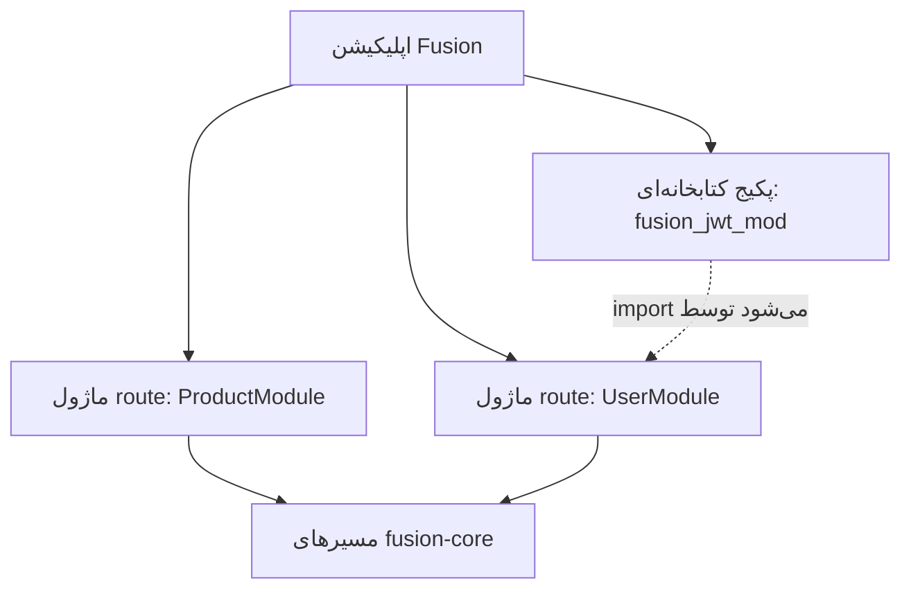
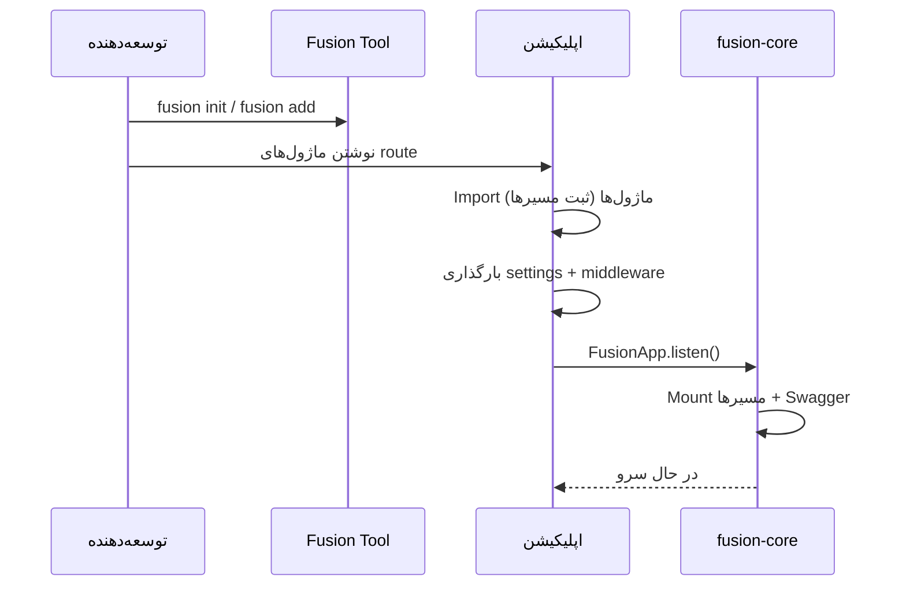

## چیست؟

**FMA (Fusion Module Architecture)** شیوهٔ ساختاربندی اپلیکیشن‌های بک‌اند در Fusion است:

1. **ماژول‌های route** — APIهای HTTP کلاس‌محور (`FusionBaseApi` + ثبت مسیر)
2. **پکیج‌های کتابخانه‌ای** — پکیج‌های قابل انتشار و نصب (`fusion module init` / `fusion add`)
3. **هستهٔ مشترک Rust** — یک موتور برای مسیریابی و معنای HTTP در همهٔ زبان‌ها

FMA یک runtime یا host پلاگین جدا نیست. یک قرارداد معماری است که با چیدمان پروژه، نام‌گذاری، بسته‌بندی CLI و مدل مسیریابی کلاس‌محور پشتیبانی می‌شود.

## چرا؟

بدون مرز واضح ماژول، بک‌اندها معمولاً به یک پکیج واحد تبدیل می‌شوند که route، helper و side-effect با هم قاطی می‌شوند. هدف FMA:

- نگه داشتن سطح HTTP هر resource در یک جا (کلاس ماژول route)
- اجازه دادن به منطق قابل استفادهٔ مجدد برای انتشار به‌صورت پکیج عادی (نه پلاگین خاص فریم‌ورک)
- قابل تعویض نگه داشتن باندینگ‌های زبانی روی همان معنای هسته
- ثبت صریح (import / register) تا startup قابل پیش‌بینی باشد

## چگونه — دو نوع ماژول



| نوع | چیست؟ | چگونه ساخته می‌شود | چگونه اپ استفاده می‌کند |
| --- | --- | --- | --- |
| **ماژول route** | زیرکلاس `FusionBaseApi` با handlerهای HTTP | دستی زیر `src/modules/...` (یا scaffold با `fusion init`) | فایل را در `main` import کنید تا `@route` اجرا شود؛ handlerها هنگام listen mount می‌شوند |
| **پکیج کتابخانه‌ای** | پکیج عادی Python / TS / Rust با `fusion.module.toml` | `fusion module init` | `fusion add --github ...` سپس `import` / `require` مثل هر dependency |

این‌ها **مفهوم‌های متفاوت**اند. «module» در نام کلاس route (`ProductModule`) را با پکیج CLI (`fusion_jwt_mod`) قاطی نکنید.

## اصول طراحی

### ۱. ثبت صریح

ماژول‌های route وقتی ماژول تعریف‌کننده‌شان import شود ثبت می‌شوند (decoratorهای Python/Node) یا وقتی `Route.Register` را صدا بزنید (C#). Fusion دایرکتوری‌ها را برای کلاس‌ها در runtime اسکن نمی‌کند.

### ۲. مالکیت resource

یک ماژول route معمولاً یک stem مسیر را از طریق `[module]` مالک است (مثلاً `ProductModule` → `product`). Handlerهای convention (`get` / `post` / …) و مسیرهای HTTP سفارشی اختیاری (`@http_get` … `@http_options`، …) روی همان کلاس می‌مانند.

### ۳. پکیج‌ها کتابخانه هستند

ماژول‌های CLI به‌صورت خودکار route نمی‌شوند. بعد از `fusion add`، توابع/کلاس‌ها را import می‌کنید و از ماژول‌های route، middleware یا startup صدا می‌زنید.

### ۴. جهت وابستگی

جهت پیشنهادی:

```text
نقطهٔ ورود اپلیکیشن
  → ماژول‌های route
    → پکیج‌های کتابخانه‌ای / helperهای مشترک
      → باندینگ fusion-framework
        → fusion-core
```

ماژول‌های route نباید helperهای داخلی یکدیگر را سرسری import کنند. کد مشترک را به پکیج کتابخانه‌ای یا یک پوشهٔ کوچک مشترک اپ استخراج کنید.

### ۵. جداسازی سطح HTTP

نگرانی‌های HTTP (کد وضعیت، envelope پاسخ، path param) را در ماژول‌های route نگه دارید. helperهای دامنهٔ قابل استفادهٔ مجدد را وقتی برای چند اپ لازم‌اند، در پکیج کتابخانه‌ای بگذارید.

## مرزهای ماژول

### ماژول route — داخلش باشد

- Handlerهای HTTP (`get`, `post`, `@http_get` … `@http_options`، …)
- نگاشت request/response برای آن resource
- Middleware / roles محدود به همان route
- متادیتای Swagger برای آن عملیات‌ها

### ماژول route — داخلش نباشد

- Startup سراسری فرآیند (`listen()`، بارگذاری همهٔ settings) — در entrypoint بماند
- Resourceهای نامرتبط (به کلاس دیگر بشکنید)
- کتابخانه‌های سنگین قابل استفادهٔ مجدد برای اپ‌های دیگر — پکیج استخراج کنید

### پکیج کتابخانه‌ای — داخلش باشد

- توابع / کلاس‌های خالصی که اپ‌ها import می‌کنند
- هستهٔ اختیاری native Rust با باندینگ PyO3 / N-API (وقتی از scaffold Rust استفاده می‌کنید)
- متادیتای `fusion.module.toml` و مراحل build

### پکیج کتابخانه‌ای — داخلش نباشد

- فرض کردن چیدمان خاص `main.py` یک اپ
- ثبت routeهای سراسری مگر پکیج API صریح «این تابع register را صدا بزن» را مستند کرده باشد

## چرخهٔ عمر (مفهومی)



جزئیات: [چرخهٔ عمر اپلیکیشن](./lifecycle).

## ارتباط بین ماژول‌ها

Fusion **message bus یا service locator داخلی ندارد**. ماژول‌ها این‌گونه ارتباط می‌گیرند:

| سازوکار | کاربرد معمول |
| --- | --- |
| **importهای Python/TS/C#** | ماژول route A helper را از پکیج کتابخانه‌ای import می‌کند |
| **HTTP** | کلاینت خارجی (یا سرویس دیگر) ماژول‌های route را صدا می‌زند |
| **Request state** | Middleware در `request.state` می‌نویسد؛ handler می‌خواند (مثلاً payload JWT) |
| **Settings مشترک** | هر دو از `fusion.<env>.json` / façade تنظیمات می‌خوانند |

**DI container** و **RPC خودکار بین ماژول‌ها** وجود ندارد.

## API عمومی در برابر داخلی

| سطح | راهنما |
| --- | --- |
| مسیرهای route | API عمومی HTTP — در صورت نیاز با `version=` نسخه‌گذاری کنید |
| `__init__` / exportهای پکیج | API عمومی import برای مصرف‌کننده‌ها |
| Helperهای خصوصی | پیشوند یا ماژول داخلی؛ بدون استخراج پکیج بین ماژول‌های route import نکنید |

## پیکربندی داخل ماژول‌ها

- **سراسری اپ:** `fusion.<env>.json` (+ overlay پایتون `core/settings.py`)
- **ماژول route:** گزینه‌های Swagger/route روی `@route` / `[Route]`
- **پکیج کتابخانه‌ای:** قراردادهای config خودش (در README پکیج مستند کنید) — Fusion به‌طور خودکار config به پکیج تزریق نمی‌کند

## مسیریابی داخل ماژول‌ها

ببینید: [ماژول‌های route اپلیکیشن](./application-modules) و راهنماهای زبان:

- [Router پایتون](../../python/v1/router)
- [Router تایپ‌اسکریپت](../../typescript/v1/router)
- [Router سی‌شارپ](../../csharp/v1/router)

## نسخه‌گذاری

| چه چیزی | چگونه |
| --- | --- |
| نسخه‌های API HTTP | `@route(..., version="v1")` → پیشوند مسیر + مشخصات OpenAPI جدا |
| پکیج‌های کتابخانه‌ای | Semver در `fusion.module.toml` / مانیفست پکیج؛ نصب با `@v1.0.0` از طریق CLI |
| پکیج‌های فریم‌ورک | PyPI/npm `fusion-framework`، NuGet `Fusion-Framework` (فعلاً **1.2.6** در ریپوی فریم‌ورک) |

## وابستگی‌های دایره‌ای

FMA شکستن چرخهٔ خاصی ندارد. از این‌ها پرهیز کنید:

- ماژول route A که helper خصوصی B را import می‌کند و برعکس
- پکیج‌های کتابخانه‌ای که entrypoint اپ را import می‌کنند

کد مشترک را به پایین، به پکیج سوم یا پوشهٔ مشترک بکشید.

## قراردادهای نام‌گذاری

| نوع | قرارداد |
| --- | --- |
| کلاس route | `SomethingModule` (اختیاری اما stem تمیز `[module]` می‌دهد) |
| پوشهٔ اپ | `src/modules/<name>/` (پیش‌فرض scaffold) |
| شناسهٔ پکیج کتابخانه‌ای | پیشنهادی `fusion_<name>_mod` (Python) / `fusion-<name>-mod` (npm) — ببینید [ماژول‌های CLI](../../cli/v1/modules) |

## ترکیب پیشنهادی

```text
my-app/
├── main.py
├── fusion.dev.json
├── core/settings.py
└── src/modules/
    ├── products/products.py    # ماژول route
    └── users/users.py          # ماژول route

# ریپوی جدا
fusion-jwt-mod/                 # پکیج کتابخانه‌ای
├── fusion.module.toml
└── ...
```

## ضدالگوها (مخصوص FMA)

لیست کامل: [ضدالگوها](./anti-patterns). خلاصه:

- رفتار با پکیج‌های کتابخانه‌ای به‌عنوان پلاگین route خودکار
- یک `AppModule` غول‌پیکر با handlerهای نامرتبط
- گذاشتن `FusionApp.listen()` داخل هر فایل route
- import متقابل ماژول‌های route به‌جای استخراج پکیج

## گام‌های بعدی

- [ماژول‌های route اپلیکیشن](./application-modules)
- [پکیج‌های قابل استفادهٔ مجدد](./packages)
- [ساختار پروژه](./project-structure)
