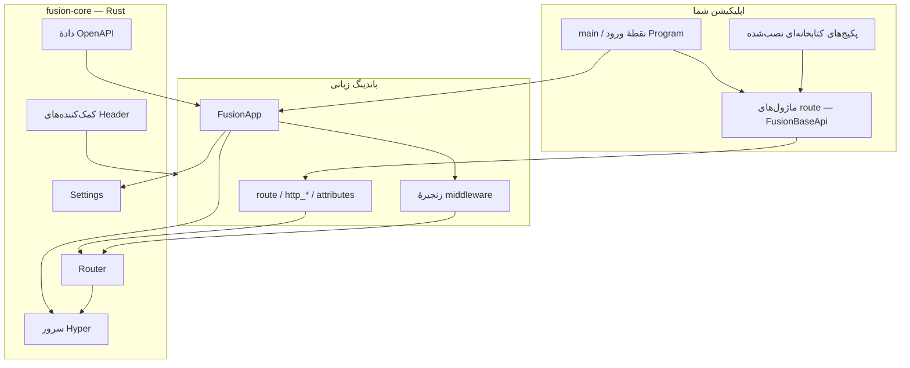

## Fusion چیست؟

**Fusion Framework** یک فریم‌ورک HTTP کلاس‌محور است. ماژول‌های API را به‌صورت کلاس (`FusionBaseApi`) تعریف می‌کنید، با decorator یا attribute مسیر ثبت می‌کنید، و `FusionApp` را اجرا می‌کنید. هستهٔ مشترک **Rust** (`fusion-core`) مسئول سرو کردن HTTP، مسیریابی، تنظیمات، کمک‌کننده‌های header و سریالایز پاسخ است. باندینگ‌های زبانی (Python، TypeScript/Node.js، C#) نازک می‌مانند و روی تجربهٔ توسعه‌دهنده تمرکز دارند.

نسخهٔ فعلی پکیج‌های فریم‌ورک در مخزن متن‌باز: **1.2.6** (ریپوی [fusion-framework](https://github.com/cipherunits/fusion-framework)).

## فلسفهٔ طراحی

| اصل | معنا در عمل |
| --- | --- |
| هستهٔ مشترک | توکن‌های مسیر، تنظیمات، کدهای وضعیت و کمک‌کننده‌های header یک‌بار در Rust پیاده می‌شوند |
| API کلاس‌محور | Handlerها روی کلاس‌ها هستند، نه توابع آزاد — هر ماژول سطح یک resource را مالک است |
| باندینگ نازک | Python / Node / C# همان معنای HTTP را با syntax بومی خود نشان می‌دهند |
| ثبت صریح | Import کردن ماژول route (یا `Route.Register`) آن را ثبت می‌کند؛ اسکن جادویی فایل‌سیستم وجود ندارد |
| پکیج‌های قابل ترکیب | کتابخانه‌های قابل استفادهٔ مجدد پکیج‌های عادی‌اند که با Fusion Tool نصب می‌شوند (`fusion add`) |

## معماری سطح بالا

## لایه‌هایی که با آن‌ها کار می‌کنید

| لایه | مسئولیت |
| --- | --- |
| **Application** | `main.py` / فایل ورود، JSON محیط، لیست middleware، import ماژول‌ها |
| **Route module** | کلاس `FusionBaseApi` با `@route` / `route()` / `[Route]` — مالک handlerهای HTTP یک resource |
| **Library package** | پکیج قابل انتشار با `fusion module init` و نصب با `fusion add` — کد قابل import عادی، نه پلاگین خاص runtime |
| **Binding** | API مخصوص زبان روی هستهٔ Rust |
| **fusion-core** | سرور HTTP، router، settings، توکن‌های نام‌گذاری، fingerprint، سریالایز |

## FMA (Fusion Module Architecture)

FMA مدل ماژولاریتی Fusion است: اپلیکیشن از **ماژول‌های route** و اختیاری **پکیج‌های قابل استفادهٔ مجدد** تشکیل می‌شود، با مرز واضح بین سطح HTTP و کتابخانه‌های مشترک.

→ جزئیات: [معماری ماژول Fusion (FMA)](./fma)

## مسیر یادگیری

1. [Fusion چیست و چه نیست](./what-fusion-is-not) — مرز دامنه (بدون ORM، بدون DI container، …)
2. [Workspace و crateها](./workspace) — جای هسته در برابر باندینگ‌ها
3. [ساختار پروژه](./project-structure) — آنچه `fusion init` می‌سازد
4. **[Fusion Tool](../../cli/v1)** — scaffold اپ و محیط‌ها
5. شروع زبان: [Python](../../python/v1/getting-started) · [TypeScript](../../typescript/v1/getting-started) · [C#](../../csharp/v1/getting-started)
6. [ماژول‌های route اپلیکیشن](./application-modules)
7. [پکیج‌های قابل استفادهٔ مجدد](./packages) · [ماژول‌های CLI](../../cli/v1/modules)
8. [چرخهٔ عمر اپلیکیشن](./lifecycle) · [تنظیمات و پیکربندی](./settings) · [چرخهٔ عمر درخواست](./request-lifecycle)
9. [بهترین شیوه‌ها](./best-practices) · [ضدالگوها](./anti-patterns)

## ابزارهای مرتبط

- **[Fusion Tool](../../cli/v1)** — scaffold اپ، محیط‌ها، دستورات، پکیج‌ها
- **[Fusion Desktop](https://fusion.cipherunit.xyz/fa/gui)** — GUI برای مدیریت بک‌اندهای Fusion
