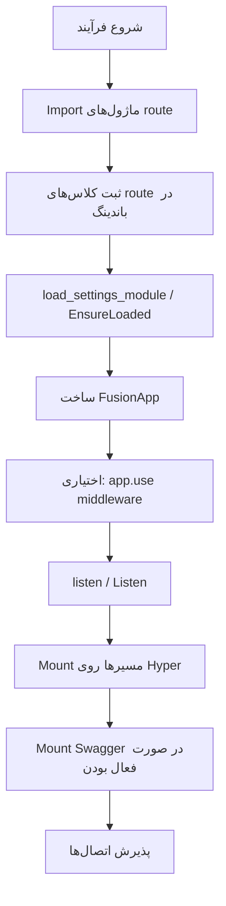
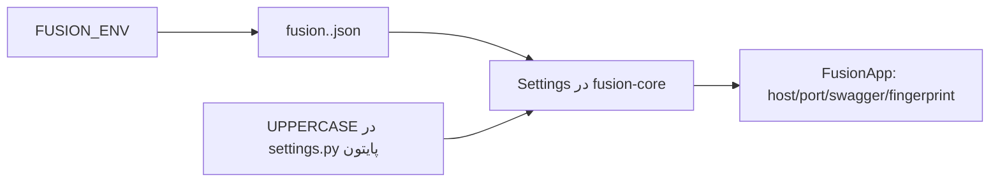

## چیست؟

**چرخهٔ عمر اپلیکیشن** ترتیب گام‌ها از شروع فرآیند تا سرو ترافیک HTTP است.

## توالی startup

### جزئیات گام‌ها

| گام | چه اتفاقی می‌افتد |
| --- | --- |
| Import / register | Python/Node: decoratorها هنگام import اجرا می‌شوند. C#: `Route.Register<T>()` |
| Settings | بارگذاری `fusion.<env>.json` (`FUSION_ENV`، پیش‌فرض `dev`). پایتون ممکن است attrs با حروف بزرگ از `settings` / `core.settings` را merge کند |
| `FusionApp` | settings، لیست middleware و handle موتور native را نگه می‌دارد |
| Middleware | زنجیرهٔ سراسری آماده می‌شود |
| `listen` | باندینگ مسیرهای ثبت‌شده، مسیرهای اختیاری Swagger، bind روی host/port، و سرو blocking |

## جریان تنظیمات

اگر JSON یک آبجکت سطح‌بالای `config` داشته باشد (سبک scaffold CLI)، آن آبجکت به‌عنوان settings merge می‌شود. وگرنه کلیدهای سطح‌بالا (به‌جز `env` / `commands`) merge می‌شوند.

## Shutdown

`listen()` معمولاً تا پایان فرآیند block می‌کند. API جداگانه‌ای برای «graceful shutdown» فراتر از سیگنال‌های عادی OS مستند نشده — مدیریت سیگنال را مسئولیت اپلیکیشن بدانید مگر باندینگ شما dispose/`using` داشته باشد (`FusionApp` در C# از `IDisposable` است).

## بعدی

- [تنظیمات و پیکربندی](./settings) — `fusion.<env>.json`، `FUSION_ENV`، overlayها
- [چرخهٔ عمر درخواست](./request-lifecycle)
- Config زبان: [پایتون](../../python/v1/config) · [تایپ‌اسکریپت](../../typescript/v1/config) · [سی‌شارپ](../../csharp/v1/config)
