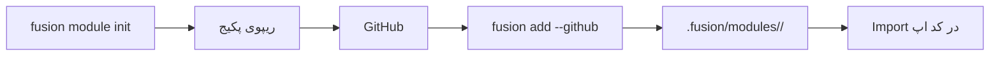

## چیست؟

یک **پکیج کتابخانه‌ای Fusion** (در CLI اغلب «module» نامیده می‌شود) یک کتابخانهٔ قابل انتشار با مانیفست `fusion.module.toml` است. با `fusion add` داخل اپ نصب می‌شود و از طریق import عادی زبان مصرف می‌شود.

به‌صورت خودکار به‌عنوان مسیر HTTP mount **نمی‌شود**.

## چرا؟

استفادهٔ مجدد از helperهای middleware، validatorها، کلاینت‌ها یا کد native در بسیاری از اپ‌های Fusion بدون کپی فایل.

## چگونه؟

مرجع کامل CLI: [ماژول‌ها](../../cli/v1/modules).



### ساخت

```bash
fusion module init --lang python --name jwt --description "JWT helpers"
```

### نصب داخل اپ

از پروژه‌ای که `fusion-framework.toml` دارد:

```bash
fusion add --github OWNER/fusion-jwt-mod@v1.0.0
```

### استفاده

```python
from fusion_jwt_mod import some_helper
```

Helperها را از ماژول‌های route، middleware یا startup صدا بزنید — هرچه با طراحی شما جور است.

## ماژول اپلیکیشن در برابر پکیج قابل استفادهٔ مجدد

| | ماژول route | پکیج کتابخانه‌ای |
| --- | --- | --- |
| محل | ریپوی اپ (`src/modules`) | ریپوی جدا (پیشنهادی) |
| مسیر HTTP ثبت می‌کند؟ | بله | فقط اگر *خودتان* کدی بنویسید که ثبت کند |
| سازوکار نصب | Git / سورس اپ | `fusion add` + import |
| مانیفست | لازم نیست | `fusion.module.toml` |

## بهترین شیوه‌ها

- پکیج‌ها را متمرکز نگه دارید (یک نگرانی)
- exportهای عمومی را در README پکیج مستند کنید
- با تگ برای `fusion add …@vX.Y.Z` نسخه‌گذاری کنید
- وقتی یک هستهٔ native باید به hostهای Python و Node سرو بدهد، scaffold Rust را ترجیح دهید

## همچنین ببینید

- [FMA](./fma)
- [ماژول‌های CLI](../../cli/v1/modules)
