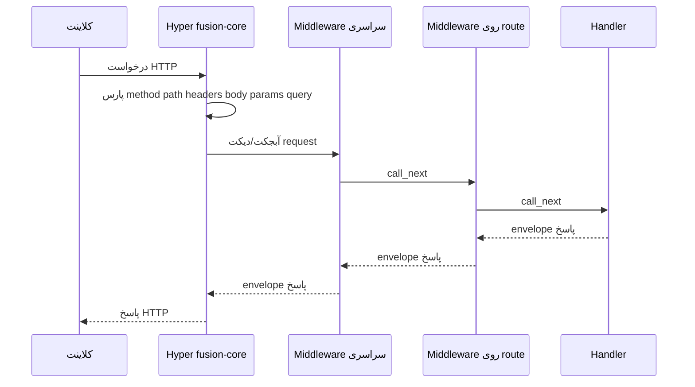

## Pipeline



## فیلدهای request

| فیلد | معنا |
| --- | --- |
| `method` | فعل HTTP |
| `path` | مسیر درخواست |
| `headers` | نقشهٔ header |
| `body` | بدنهٔ خام |
| `params` | پارامترهای مسیر |
| `query` | نقشهٔ query string |
| `state` | کیسهٔ mutable برای middleware (مثلاً JWT) |

## Envelope پاسخ

Handlerها (یا middleware که زنجیره را کوتاه می‌کند) آبجکتی شبیه این برمی‌گردانند:

```json
{ "status": 200, "body": { }, "headers": { } }
```

از helperهای `self.response(...)` / `Response(...)` استفاده کنید. بدنه‌های غیررشته‌ای در صورت مناسب توسط هسته JSON می‌شوند.

## ترتیب middleware

1. Middleware سراسری ثبت‌شده روی `FusionApp` (outer اول)
2. Middleware روی route از `@route(..., middleware=...)` / `roles=...`
3. Handler

برگرداندن `{ "status": …, "body": … }` زنجیره را متوقف می‌کند.

## بایندینگ پارامتر پایتون

فقط در پایتون، **پارامترهای امضای** handler از path → body (برای متدهای نوشتن) → query پر می‌شوند. این یک **DI container** نیست. Node و C# به‌جای آن `params` / `query` / `body` را روی آبجکت request نشان می‌دهند.

## Headerهای fingerprint

وقتی فعال باشد، Fusion ممکن است headerهای هویت مانند `X-Powered-By`، `X-Framework` و `X-Fusion-Version` را بچسباند (لایهٔ middleware و/یا سرور بسته به باندینگ و `fingerprint.enabled`). راهنماهای middleware زبان را ببینید.
