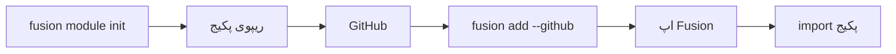

## Overview

**ماژول**های Fusion پکیج‌های کتابخانه‌ای قابل انتشار هستند — نه پلاگین route.
یک پکیج معمولی می‌نویسید (Python، TypeScript یا Rust)، روی GitHub می‌گذارید، بعد با CLI داخل اپ Fusion نصب می‌کنید. از آن به بعد مثل هر dependency دیگری import می‌کنید.



## نام‌گذاری پیشنهادی

این الگو **پیشنهادی** است، اجباری نیست. می‌توانید در `fusion.module.toml` عوضش کنید.

| Host | الگو | مثال (`--name jwt`) |
| --- | --- | --- |
| Python | `fusion_<name>_mod` | `fusion_jwt_mod` → `from fusion_jwt_mod import ...` |
| npm / TypeScript | `fusion-<name>-mod` | `fusion-jwt-mod` → `import { ... } from "fusion-jwt-mod"` |

پیش‌فرض ریپو / پوشه: `fusion-<name>-mod`.

## ساخت ماژول

```bash
fusion module init
```

در حالت تعاملی این‌ها پرسیده می‌شود:

1. زبان پیاده‌سازی — **Python**، **TypeScript**، **C#** یا **Rust**
2. نام ماژول (id)
3. توضیحات
4. پوشهٔ خروجی (پیش‌فرض تعاملی `fusion-{id}-mod`)

غیرتعاملی:

```bash
fusion module init --lang python --name example --description "اولین ماژول من"
fusion module init --lang csharp --name helpers --description "کمک‌کننده‌های مشترک"
fusion module init --lang rust --name auth --description "ابزار احراز هویت" ./fusion-auth-mod
```

### زبان‌ها

| زبان | خروجی |
| --- | --- |
| **Python** | پکیج خالص پایتون در `python/fusion_<name>_mod/` |
| **TypeScript** | پکیج npm با `js/` و `src/` |
| **C#** | کتابخانهٔ .NET (سبک نام `Fusion<Name>Mod`) |
| **Rust** | هستهٔ Rust مشترک + هدف‌های اختیاری **PyO3**، **N-API** و **C#** |

Rust وقتی مفید است که یک هستهٔ native برای چند host بخواهید. `--lang rust` غیرتعاملی هر سه هدف host را روشن می‌کند؛ حالت تعاملی اجازهٔ multi-select می‌دهد.

### ساختار اسکفولد (Python)

```text
fusion-example-mod/
├── fusion.module.toml
├── pyproject.toml
├── README.md
└── python/
    └── fusion_example_mod/
        ├── __init__.py
        └── hello.py
```

اسکفولد یک `hello()` نمونه دارد. آن را با API خودتان عوض کنید.

## Manifest

هر ماژول فایل `fusion.module.toml` دارد:

```toml
[module]
id = "example"
name = "example"
version = "0.1.0"
description = "اولین ماژول من"

[module.impl]
language = "python"

[module.targets]
python = true
typescript = false

[module.entry]
python = "fusion_example_mod"

[module.build]
python = "pip install -e ."
```

- **`entry`** — نام پکیج برای import (یا نام npm برای TypeScript)
- **`build`** — دستورهایی که `fusion add` بعد از دانلود اجرا می‌کند
- **`targets`** — زبان‌های host که ماژول پشتیبانی می‌کند

## انتشار

1. پکیج را پیاده کنید
2. روی GitHub push کنید
3. داخل اپ Fusion دستور `fusion add` را بزنید

## نصب داخل اپ

از پروژه‌ای که `fusion-framework.toml` دارد:

```bash
fusion add --github OWNER/fusion-example-mod
fusion add --github OWNER/fusion-example-mod@v1.0.0
fusion add --github https://github.com/OWNER/fusion-example-mod
```

CLI این کارها را می‌کند:

1. دانلود ریپو
2. اعتبارسنجی `fusion.module.toml`
3. کپی به `.fusion/modules/<id>/`
4. اجرای build / install (`pip install -e .`، `maturin` یا `npm`)
5. ثبت در `fusion-framework.toml` زیر `[[modules]]`
6. برای hostهای TypeScript، لینک در `package.json`

## استفاده در اپ

Python:

```python
from fusion_example_mod import hello

print(hello("world"))
```

TypeScript:

```ts
import { hello } from "fusion-example-mod";

console.log(hello("world"));
```

توابع را از routeها، سرویس‌ها یا هر جای دیگر اپ صدا بزنید — ماژول‌ها کتابخانهٔ معمولی هستند.


## هر زبان چه چیزی scaffold می‌کند؟

### Python (`--lang python`)

پکیج **خالص پایتون** قابل نصب:

```text
fusion-<id>-mod/
├── fusion.module.toml
├── pyproject.toml
└── python/fusion_<id>_mod/
    ├── __init__.py
    └── hello.py
```

- نام پکیج: `fusion_<id>_mod`
- Build هنگام `fusion add`: `pip install -e .`
- فقط برای اپ‌های پایتون

### TypeScript (`--lang typescript`)

پکیج **npm** با سورس TypeScript → خروجی `js/`:

```text
fusion-<id>-mod/
├── package.json / tsconfig.json
├── src/index.ts
└── js/index.js + index.d.ts
```

- نام: `fusion-<id>-mod`
- Build: `npm install && npm run build`
- بعد از add، لینک `file:.fusion/modules/<id>` در `package.json` اپ

### C# (`--lang csharp`)

کتابخانهٔ **.NET** (`net10.0`):

```text
Fusion<Name>Mod/
├── Fusion<Name>Mod.csproj
└── Module.cs    # Module.Hello()
```

- Build: `dotnet build -c Release …`
- بعد از add: `dotnet add reference`

### Rust (`--lang rust`)

**Cargo workspace** با هستهٔ مشترک و باندینگ‌های اختیاری:

```text
crates/core/           # کتابخانهٔ Rust
bindings/python/       # PyO3 (اختیاری)
bindings/node/         # N-API (اختیاری)
bindings/csharp/       # P/Invoke (اختیاری)
```

- تعاملی: multi-select هدف‌های host
- غیرتعاملی: هر سه host به‌طور پیش‌فرض روشن
- وقتی یک پیاده‌سازی native باید به چند زبان سرو بدهد

## جریان بعد از scaffold

1. API خود را پیاده کنید
2. به GitHub پوش و تگ بزنید
3. در اپ: `fusion add --github OWNER/REPO@v1.0.0`
4. Import کنید — **route خودکار mount نمی‌شود**
