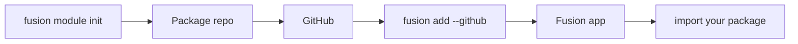

## نمای کلی

**ماژول**های Fusion پکیج‌های کتابخانه‌ای قابل انتشار هستند — نه پلاگین route.
یک پکیج معمولی می‌نویسید (Python، TypeScript یا Rust)، روی GitHub می‌گذارید، بعد با CLI داخل اپ Fusion نصب می‌کنید. از آن به بعد مثل هر dependency دیگری import می‌کنید.



## نام‌گذاری پیشنهادی

این الگو **پیشنهادی** است، اجباری نیست. می‌توانید در `fusion.module.toml` عوضش کنید.

| Host | الگو | مثال (`--name jwt`) |
| --- | --- | --- |
| Python | `fusion_<name>_mod` | `fusion_jwt_mod` → `from fusion_jwt_mod import ...` |
| npm / TypeScript | `fusion-<name>-mod` | `fusion-jwt-mod` → `import { ... } from "fusion-jwt-mod"` |

پیش‌فرض ریپو / پوشه: `fusion-<name>-mod`.

## ساخت ماژول

```bash
fusion module init
```

در حالت تعاملی این‌ها پرسیده می‌شود:

1. زبان پیاده‌سازی — **Python**، **TypeScript**، **C#** یا **Rust**
2. نام ماژول (id)
3. توضیحات
4. پوشهٔ خروجی (پیش‌فرض تعاملی `fusion-{id}-mod`)

غیرتعاملی:

```bash
fusion module init --lang python --name example --description "My first module"
fusion module init --lang csharp --name helpers --description "Shared helpers"
fusion module init --lang rust --name auth --description "Auth helpers" ./fusion-auth-mod
```

### زبان‌ها

| زبان | خروجی |
| --- | --- |
| **Python** | پکیج خالص پایتون در `python/fusion_<name>_mod/` |
| **TypeScript** | پکیج npm با `js/` و `src/` |
| **C#** | کتابخانهٔ .NET (سبک نام `Fusion<Name>Mod`) |
| **Rust** | هستهٔ Rust مشترک + هدف‌های اختیاری **PyO3**، **N-API** و **C#** |

Rust وقتی مفید است که یک هستهٔ native برای چند host بخواهید. `--lang rust` غیرتعاملی هر سه هدف host را روشن می‌کند؛ حالت تعاملی اجازهٔ multi-select می‌دهد.

### ساختار اسکفولد (Python)

```text
fusion-example-mod/
├── fusion.module.toml
├── pyproject.toml
├── README.md
└── python/
    └── fusion_example_mod/
        ├── __init__.py
        └── hello.py
```

اسکفولد یک `hello()` نمونه دارد. آن را با API خودتان عوض کنید.


## هر زبان چه چیزی scaffold می‌کند؟

### Python (`--lang python`)

پکیج **خالص پایتون** قابل نصب:

```text
fusion-<id>-mod/
├── fusion.module.toml
├── pyproject.toml          # setuptools, package under python/
├── README.md
├── .gitignore
└── python/
    └── fusion_<id>_mod/
        ├── __init__.py     # exports hello()
        └── hello.py
```

- نام پکیج: `fusion_<id>_mod` (با underscore)
- Build هنگام `fusion add`: `pip install -e .`
- هدف host: فقط اپ‌های پایتون
- `hello()` را با API عمومی خودتان عوض کنید؛ اپ‌ها `from fusion_<id>_mod import …`

### TypeScript (`--lang typescript`)

پکیج **npm** با سورس TypeScript که به `js/` کامپایل می‌شود:

```text
fusion-<id>-mod/
├── fusion.module.toml
├── package.json            # name: fusion-<id>-mod, build: tsc
├── tsconfig.json
├── src/index.ts            # hello()
├── js/index.js + index.d.ts
├── README.md
└── .gitignore
```

- نام پکیج: `fusion-<id>-mod`
- Build: `npm install && npm run build`
- هدف host: اپ‌های TypeScript/Node Fusion
- بعد از `fusion add`، CLI مسیر `file:.fusion/modules/<id>` را در `package.json` اپ لینک می‌کند

### C# (`--lang csharp`)

کتابخانهٔ **.NET class library** (`net10.0`):

```text
fusion-<id>-mod/
├── fusion.module.toml
├── Fusion<Name>Mod/
│   ├── Fusion<Name>Mod.csproj
│   └── Module.cs           # Module.Hello()
├── README.md
└── .gitignore
```

- پکیج / assembly: `Fusion<Name>Mod` (PascalCase از id)
- Build: `dotnet build -c Release …`
- هدف host: اپ‌های C# Fusion
- بعد از `fusion add`، CLI دستور `dotnet add reference` را روی `.csproj` وندور شده اجرا می‌کند

### Rust (`--lang rust`)

**Cargo workspace** با هستهٔ Rust مشترک و باندینگ‌های اختیاری host:

```text
fusion-<id>-mod/
├── fusion.module.toml
├── Cargo.toml              # workspace
├── crates/core/            # shared Rust library (hello)
├── bindings/python/        # optional PyO3 (if Python target selected)
├── bindings/node/          # optional N-API (if TypeScript target selected)
├── bindings/csharp/        # optional P/Invoke wrapper (if C# target selected)
├── README.md
└── .gitignore
```

- حالت تعاملی: multi-select برای فعال‌کردن hostها (Python / TypeScript / C#)
- غیرتعاملی `--lang rust`: **هر سه** host به‌طور پیش‌فرض روشن
- Build: `cargo build --release` به‌علاوهٔ مراحل هر host (`maturin`، `npm run build`، `dotnet build`) که در `fusion.module.toml` تعریف شده
- Rust را وقتی انتخاب کنید که یک پیاده‌سازی native باید به چند زبان host سرو بدهد

## بعد از scaffold — جریان انتشار و نصب

1. API خود را پیاده کنید (`hello` / `Module.Hello` را عوض کنید)
2. به GitHub پوش کنید و نسخه تگ بزنید (`v1.0.0`)
3. در پوشهٔ یک **اپ** Fusion: `fusion add --github OWNER/REPO@v1.0.0`
4. پکیج را در route moduleها / middleware import کنید — **routeها به‌صورت خودکار mount نمی‌شوند**

## فیلدهای مهم `fusion.module.toml`

| بخش | کاربرد |
| --- | --- |
| `[module]` | `id`، `name`، `version`، `description` |
| `[module.impl]` | `language` = `python` \| `typescript` \| `csharp` \| `rust` |
| `[module.targets]` | کدام اپ‌های host می‌توانند این ماژول را نصب کنند |
| `[module.entry]` | نام import / پکیج برای هر host |
| `[module.build]` | دستورهای شلی که `fusion add` بعد از vendor اجرا می‌کند |

قوانین id: حروف کوچک، رقم، خط تیره؛ باید با حرف شروع شود.

## Manifest

هر ماژول فایل `fusion.module.toml` دارد:

```toml
[module]
id = "example"
name = "example"
version = "0.1.0"
description = "My first module"

[module.impl]
language = "python"

[module.targets]
python = true
typescript = false

[module.entry]
python = "fusion_example_mod"

[module.build]
python = "pip install -e ."
```

- **`entry`** — نام پکیج برای import (یا نام npm برای TypeScript)
- **`build`** — دستورهایی که `fusion add` بعد از دانلود اجرا می‌کند
- **`targets`** — زبان‌های host که این ماژول پشتیبانی می‌کند

## انتشار

1. پکیج را پیاده کنید
2. Commit و push به GitHub
3. از داخل اپ Fusion دستور `fusion add` را بزنید

## نصب داخل اپ

از پروژه‌ای که از قبل `fusion-framework.toml` دارد:

```bash
fusion add --github cipherunits/hello-fusion
fusion add --github OWNER/fusion-example-mod@v1.0.0
fusion add --github https://github.com/OWNER/fusion-example-mod
```

CLI این کارها را می‌کند:

1. دانلود ریپو
2. اعتبارسنجی `fusion.module.toml`
3. vendor کردن زیر `.fusion/modules/<id>/`
4. اجرای مراحل build / install اعلام‌شده (`pip install -e .`، `maturin` یا `npm`)
5. ثبت ماژول در `fusion-framework.toml` زیر `[[modules]]`
6. برای hostهای TypeScript، لینک پکیج در `package.json`

## استفاده در اپ

Python:

```python
from fusion_example_mod import hello

print(hello("world"))
```

TypeScript:

```ts
import { hello } from "fusion-example-mod";

console.log(hello("world"));
```

توابع را از routeها، سرویس‌ها یا هر جای دیگر اپ Fusion صدا بزنید — ماژول‌ها کتابخانهٔ معمولی هستند.
