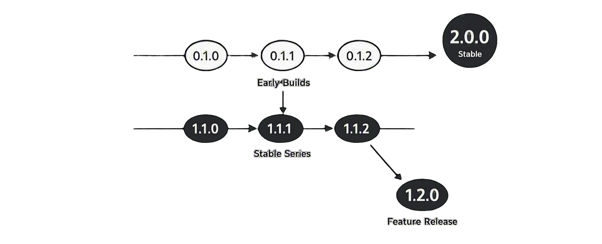

## Fusion چیست؟

**Fusion Framework** یک فریم‌ورک بک‌اند چندپلتفرمی است که روی هستهٔ مشترک Rust و **FMA (Fusion Module Architecture)** ساخته شده.

APIهای HTTP کلاس‌محور را به زبان دلخواه می‌نویسید. مسیریابی، پارس درخواست، سریالایز پاسخ، تنظیمات و کمک‌کننده‌های header در موتور Rust اجرا می‌شوند — باندینگ‌های زبانی نازک می‌مانند و روی تجربهٔ توسعه‌دهنده تمرکز دارند.

نسخهٔ فعلی پکیج‌های فریم‌ورک در مخزن متن‌باز: **1.2.6**.

## چرا Fusion وجود دارد؟

تیم‌ها اغلب به معنای یکسان HTTP در بیش از یک زبان نیاز دارند. Fusion **یک هسته** برای مسیریابی و سریالایز نگه می‌دارد و APIهای بومی در Python، TypeScript/Node.js و C# ارائه می‌دهد. اپلیکیشن‌ها از **ماژول‌های route** و اختیاری **پکیج‌های قابل استفادهٔ مجدد** ساخته می‌شوند، نه یک اسکریپت بدون ساختار.

Fusion توسط **[Cipher Unit](https://cipherunit.xyz)** توسعه داده می‌شود.

## پشتیبانی زبان

| زبان | وضعیت |
| --- | --- |
| **Python** | موجود — `pip install fusion-framework` |
| **TypeScript / Node.js** | موجود — `npm i fusion-framework` |
| **C#** | موجود — NuGet `Fusion-Framework` (namespace: `FusionFramework`) + `fusion-ffi` |

## مسیر یادگیری پیشنهادی

به این ترتیب بخوانید — اول معماری، بعد CLI، بعد زبان خودتان:

1. **[نمای کلی معماری](./architecture/v1)** — مدل ذهنی استک
2. **[Workspace و crateها](./architecture/v1/workspace)** — هسته در برابر باندینگ‌ها
3. **[FMA](./architecture/v1/fma)** — جای ماژول‌ها و پکیج‌ها
4. **[Fusion چیست و چه نیست](./architecture/v1/what-fusion-is-not)** — مرز دامنه
5. **[Fusion Tool](./cli/v1)** — scaffold پروژه و مدیریت محیط‌ها
6. راهنمای زبان: [Python](./python/v1/getting-started) · [TypeScript](./typescript/v1/getting-started) · [C#](./csharp/v1/getting-started)
7. [تنظیمات و پیکربندی](./architecture/v1/settings) — `fusion.<env>.json`، `FUSION_ENV`، overlayها
8. [Router](./python/v1/router) · [Middleware](./python/v1/middleware) · [Config زبان](./python/v1/config)
9. [پکیج‌های قابل استفادهٔ مجدد](./cli/v1/modules)
10. [Pagination](./architecture/v1/pagination) · [کدهای وضعیت](./architecture/v1/status) · [Headerها](./architecture/v1/headers)
11. [مسیرهای HTTP سفارشی](./python/v1/custom-http-routes) · [Desktop](./cli/v1/desktop) · [Snippetها](./cli/v1/vscode)
12. [بهترین شیوه‌ها](./architecture/v1/best-practices) · [عیب‌یابی](./architecture/v1/troubleshooting)

## ابزارها

- **[Fusion Tool](./cli/v1)** — CLI رسمی برای scaffold پروژه، مدیریت محیط‌ها و اجرای دستورات پروژه
- **[Fusion Desktop](/fa/gui)** — رابط گرافیکی برای مدیریت بک‌اندهای Fusion در Windows و Linux

Fusion متن‌باز است تحت [مجوز BSD](https://github.com/cipherunits/fusion-framework/blob/main/LICENSE/). دربارهٔ تیم: [cipherunit.xyz](https://cipherunit.xyz).

## نسخه‌گذاری

Fusion فریم‌ورکی جوان است؛ در حالی که هسته پایدار می‌شود، استراتژی نسخه‌گذاری عمدی داریم.

هدف، بهبود پیوسته به‌سوی پایه‌ای قابل اتکا برای بک‌اندهای production است.

