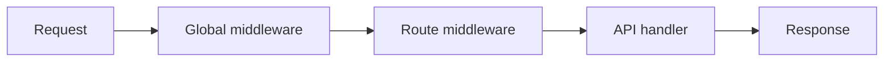

## نمای کلی

Middleware هر درخواست (یا یک route) را به‌شکل زیر می‌پیچد:

```text
(request, call_next) → response | call_next(request)
```

**Fusion هیچ middleware پیش‌فرضی ندارد.** تا خودتان چیزی ثبت نکنید، چیزی اجرا نمی‌شود — معمولاً در `main.py`.

توابعی مثل `bearer_jwt` / `require_roles` فقط ابزار اختیاری‌اند؛ باید خودتان `app.use(...)` یا `@route` را صدا بزنید.

## دو لایه



1. **Global** — روی `FusionApp` با `app.use(...)` (از لیست `MIDDLEWARE` در `main.py`)  
2. **Route** — با `middleware=[...]` یا `roles=[...]` روی `@route`

ترتیب: اول لیست global، بعد route، بعد handler.

## ثبت در `main.py`

```python
import src.modules.products.products

from fusion_framework.app import FusionApp
from fusion_framework.config import get_settings, load_settings_module

MIDDLEWARE: list = []


def main() -> None:
    load_settings_module("settings")
    app = FusionApp(get_settings())
    for middleware in MIDDLEWARE:
        app.use(middleware)
    app.listen()


if __name__ == "__main__":
    main()
```

```python
def logging_middleware(request, call_next):
    print(request["method"], request["path"])
    return call_next(request)

MIDDLEWARE = [logging_middleware]
```

## نوشتن یک middleware ساده

```python
def require_api_key(request, call_next):
    key = (request.get("headers") or {}).get("x-api-key")
    if key != "secret":
        return {"status": 401, "body": {"detail": "invalid api key"}}
    return call_next(request)
```

| عمل | روش |
| --- | --- |
| ادامه | `return call_next(request)` |
| قطع زودهنگام | `return {"status": 401, "body": {...}}` |
| اشتراک داده | `request.setdefault("state", {})["user"] = ...` |

در handler: `self.state.get("user")`.

## Middleware سطح route

```python
@route("api/[module]/", middleware=[only_post])
class UploadModule(FusionBaseApi):
    def post(self):
        return self.response({"ok": True})
```

## ابزارهای اختیاری

### `bearer_jwt()`

هدر Bearer را می‌خواند، payload را decode می‌کند (پیش‌فرض بدون verify امضا)، در `state["jwt"]` می‌گذارد.

```python
from fusion_framework import bearer_jwt
MIDDLEWARE = [bearer_jwt()]
```

### `roles=[...]` / `require_roles`

```python
@route("api/admin", roles=["admin", "super_admin"])
class AdminModule(FusionBaseApi):
    def get(self):
        return self.response({"ok": True})
```

بدون auth → `401`. نقش اشتباه → `403`.

## Middleware ناهمگام

```python
async def slow_check(request, call_next):
    await asyncio.sleep(0.01)
    return await call_next(request)
```

جزئیات: [Async](./async).

## شکل `request`

| کلید | محتوا |
| --- | --- |
| `method` / `path` / `headers` / `body` | درخواست HTTP |
| `params` / `query` | path و query |
| `state` | کیسهٔ mutable بین middleware و handler |
