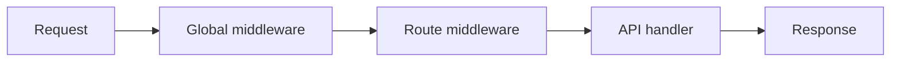

## نمای کلی

Middleware هر درخواست (یا یک route) را این‌طور می‌پیچد:

```text
(request, call_next) → response | call_next(request)
```

**Fusion به‌صورت پیش‌فرض هیچ middlewareای ندارد.** تا وقتی callableها را خودتان ثبت نکنید — معمولاً در `main.py` — چیزی اجرا نمی‌شود.

هلپرهایی مثل `bearer_jwt` / `require_roles` ابزار اختیاری‌اند. باید خودتان `app.use(...)` کنید یا به `@route` بدهید.

## دو لایه



1. **سراسری** — روی `FusionApp` با `app.use(...)` (از `MIDDLEWARE` در `main.py`)
2. **سطح route** — به‌صورت `middleware=[...]` یا `roles=[...]` روی `@route`

ترتیب: اول لیست سراسری (بیرونی → درونی)، بعد لیست route، بعد هندلر.

## ثبت در `main.py`

```python
"""Entry point: register routes, middleware, and start the server."""

import src.modules.products.products  # registers @route classes

from fusion_framework.app import FusionApp
from fusion_framework.config import get_settings, load_settings_module

# Global middleware (optional). Framework ships with none by default.
MIDDLEWARE: list = []


def main() -> None:
    load_settings_module("settings")
    app = FusionApp(get_settings())
    for middleware in MIDDLEWARE:
        app.use(middleware)
    app.listen()


if __name__ == "__main__":
    main()
```

توابع را به `MIDDLEWARE` اضافه کنید:

```python
def logging_middleware(request, call_next):
    print(request["method"], request["path"])
    return call_next(request)

MIDDLEWARE = [logging_middleware]
```

## نوشتن یک middleware ساده

```python
def require_api_key(request, call_next):
    key = (request.get("headers") or {}).get("x-api-key")
    if key != "secret":
        return {"status": 401, "body": {"detail": "invalid api key"}}
    return call_next(request)
```

| عمل | چگونه |
| --- | --- |
| ادامه | `return call_next(request)` |
| توقف زودهنگام | `return {"status": 401, "body": {...}}` |
| اشتراک داده | `request.setdefault("state", {})["user"] = ...` سپس `call_next` |

داخل هندلر، state را با `self.state` بخوانید:

```python
def get(self):
    user = self.state.get("user")
    return self.response({"user": user})
```

## Middleware سطح route

```python
from fusion_framework.route import route

def only_post(request, call_next):
    if request.get("method", "").upper() != "POST":
        return {"status": 405, "body": {"detail": "POST only"}}
    return call_next(request)

@route("api/[module]/", middleware=[only_post])
class UploadModule(FusionBaseApi):
    def post(self):
        return self.response({"ok": True})
```

## هلپرهای اختیاری

این‌ها **خودکار فعال نمی‌شوند**.

### `bearer_jwt()`

`Authorization: Bearer …` را می‌خواند، payload JWT را decode می‌کند (پیش‌فرض: decode base64 **بدون verify** — برای production `verify=` بدهید)، و در `request["state"]["jwt"]` می‌گذارد.

```python
from fusion_framework import bearer_jwt

MIDDLEWARE = [bearer_jwt()]
# or with your verifier:
# MIDDLEWARE = [bearer_jwt(verify=my_verify_fn)]
```

### `require_roles(...)` / `@route(..., roles=[...])`

انتظار payload از قبل در `state["jwt"]` با claim `roles` دارد.

```python
@route("api/admin", roles=["admin", "super_admin"])
class AdminModule(FusionBaseApi):
    def get(self):
        return self.response({"ok": True})
```

معادل:

```python
from fusion_framework.middleware import require_roles

@route("api/admin", middleware=[require_roles("admin", "super_admin")])
```

بدون auth → `401`. نقش اشتباه → `403`.

## Middleware async

از `async def` و `await call_next(request)` استفاده کنید:

```python
import asyncio

async def slow_check(request, call_next):
    await asyncio.sleep(0.01)
    return await call_next(request)

MIDDLEWARE = [slow_check]
```

می‌توانید sync و async را در یک لیست مخلوط کنید. [Async](./async) را ببینید.

## شکل request

`request` یک dict ساده است (همان شکلی که هسته به هندلرها می‌دهد):

| کلید | محتوا |
| --- | --- |
| `method` | متد HTTP |
| `path` | مسیر |
| `headers` | نقشهٔ header |
| `body` | رشتهٔ خام body |
| `params` | پارامترهای path |
| `query` | نقشهٔ query |
| `state` | کیسهٔ mutable برای middleware → هندلر |

## قواعد سرانگشتی

- فریم‌ورک هرگز خودش middleware ثبت نمی‌کند  
- middleware سراسری را در `main.py` → `MIDDLEWARE` → `app.use` بگذارید  
- auth / scoping را کنار route با `middleware=` یا `roles=` بگذارید  
- با envelope وضعیت short-circuit کنید؛ وگرنه همیشه `call_next` را صدا بزنید
