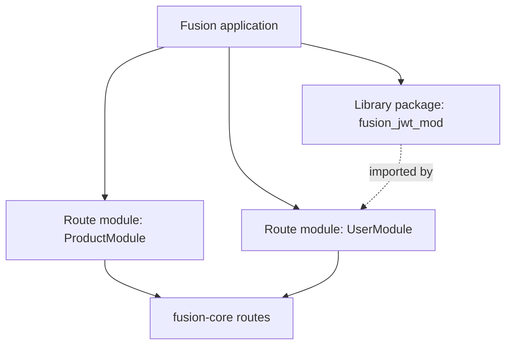
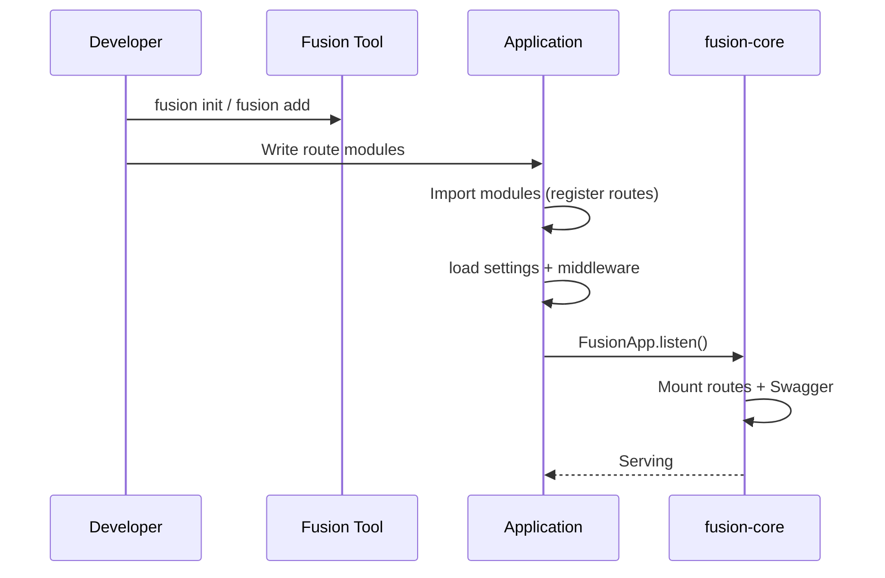

## Что это

**FMA (Fusion Module Architecture)** — способ, которым Fusion структурирует backend-приложения:

1. **Route-модули** — классовые HTTP API (`FusionBaseApi` + регистрация маршрутов)
2. **Библиотечные пакеты** — публикуемые, устанавливаемые пакеты (`fusion module init` / `fusion add`)
3. **Общее Rust-ядро** — один движок маршрутизации и HTTP-семантики для всех языков

FMA — не отдельный runtime и не хост плагинов. Это архитектурное соглашение, которое закрепляется раскладкой проекта, naming, упаковкой через CLI и классовой моделью маршрутизации.

## Зачем

Без чётких границ модулей бэкенды часто срастаются в один пакет, где маршруты, хелперы и побочные эффекты смешиваются свободно. FMA стремится:

- Держать HTTP-поверхность каждого ресурса в одном месте (класс route-модуля)
- Позволять переиспользуемую логику поставлять как обычные пакеты (не как плагины фреймворка)
- Держать языковые биндинги взаимозаменяемыми на одной core-семантике
- Делать регистрацию явной (import / register), чтобы старт был предсказуемым

## Как — два вида модулей



| Вид | Что это | Как создаётся | Как приложение использует |
| --- | --- | --- | --- |
| **Route module** | Подкласс `FusionBaseApi` с HTTP-обработчиками | Вручную под `src/modules/...` (или scaffold через `fusion init`) | Импортируйте файл в `main`, чтобы сработал `@route`; обработчики монтируются при listen |
| **Library package** | Обычный пакет Python / TS / Rust с `fusion.module.toml` | `fusion module init` | `fusion add --github ...`, затем `import` / `require` как любая зависимость |

Это **разные понятия**. Не путайте «module» в именах route-классов (`ProductModule`) с CLI-библиотечными пакетами (`fusion_jwt_mod`).

## Принципы проектирования

### 1. Явная регистрация

Route-модули регистрируются, когда импортируется определяющий их модуль (декораторы Python/Node) или когда вы вызываете `Route.Register` (C#). Fusion не сканирует каталоги в поисках классов во время выполнения.

### 2. Владение ресурсом

Route-модуль обычно владеет одним stem пути ресурса через `[module]` (например `ProductModule` → `product`). Convention-обработчики (`get` / `post` / …) и опциональные custom HTTP routes (`@http_get` … `@http_options`, …) живут на этом классе.

### 3. Пакеты — это библиотеки

CLI-модули **не** монтируются как маршруты автоматически. После `fusion add` вы импортируете функции/классы и вызываете их из route-модулей, middleware или кода старта.

### 4. Направление зависимостей

Рекомендуемое направление:

```text
Application entry
  → route modules
    → library packages / shared helpers
      → fusion-framework binding
        → fusion-core
```

Route-модули не должны между собой свободно импортировать внутренние хелперы. Лучше вынести общий код в библиотечный пакет или небольшую общую папку приложения.

### 5. Изоляция HTTP-поверхности

Держите HTTP-заботы (коды статуса, response envelopes, path-параметры) в route-модулях. Переиспользуемые domain-хелперы — в библиотечных пакетах, когда они предназначены для шаринга между приложениями.

## Границы модулей

### Route module — что должно быть внутри

- HTTP-обработчики (`get`, `post`, `@http_get` … `@http_options`, …)
- Маппинг request/response для этого ресурса
- Route-scoped middleware / roles для этого ресурса
- Swagger-метаданные этих операций

### Route module — чего не должно быть внутри

- Process-wide startup (`listen()`, загрузка всех настроек) — оставляйте в entrypoint
- Несвязанные ресурсы (разделите на другой класс)
- Тяжёлые переиспользуемые библиотеки, нужные другим приложениям — вынесите в пакет

### Library package — что должно быть внутри

- Чистые функции / классы, которые импортируют ваши приложения
- Опциональное нативное Rust-ядро с биндингами PyO3 / N-API (при Rust-scaffolds)
- Метаданные `fusion.module.toml` и шаги сборки

### Library package — чего не должно быть внутри

- Предположений о раскладке конкретного `main.py` приложения
- Регистрации глобальных маршрутов, если пакет не документирует явный API «вызовите эту register-функцию»

## Жизненный цикл (концептуально)



Подробности: [Жизненный цикл приложения](./lifecycle).

## Связь между модулями

У Fusion **нет встроенной message bus или service locator**. Модули взаимодействуют так:

| Механизм | Типичное использование |
| --- | --- |
| **Импорты Python/TS/C#** | Route-модуль A импортирует хелперы из библиотечного пакета |
| **HTTP** | Внешние клиенты (или другой сервис) вызывают route-модули |
| **Request state** | Middleware пишет в `request.state`; обработчики читают (например JWT payload) |
| **Общие настройки** | Оба читают `fusion.<env>.json` / фасад settings |

Нет **фреймворкового DI-контейнера** и **нет** автоматического inter-module RPC.

## Публичные и внутренние API

| Поверхность | Рекомендация |
| --- | --- |
| Route-пути | Публичный HTTP API — версионируйте через `version=` при необходимости |
| `__init__` / exports библиотечного пакета | Публичный import API для потребителей |
| Приватные хелперы | Префикс или внутренние модули; не импортируйте между route-модулями без выноса в пакет |

## Конфигурация внутри модулей

- **На всё приложение:** `fusion.<env>.json` (+ Python-overlay `core/settings.py`)
- **Route module:** опции Swagger/route на `@route` / `[Route]`
- **Library package:** собственные соглашения по конфигурации (документируйте в README пакета) — Fusion не инжектит конфиг пакета автоматически

## Маршрутизация внутри модулей

См. [Route-модули приложения](./application-modules) и языковые гайды:

- [Python Router](../../python/v1/router)
- [TypeScript Router](../../typescript/v1/router)
- [C# Router](../../csharp/v1/router)

## Версионирование

| Что | Как |
| --- | --- |
| Версии HTTP API | `@route(..., version="v1")` → префикс пути + отдельные OpenAPI-спеки |
| Библиотечные пакеты | Semver в `fusion.module.toml` / манифестах пакета; установка через refs `@v1.0.0` в CLI |
| Пакеты фреймворка | PyPI/npm `fusion-framework`, NuGet `Fusion-Framework` (сейчас **1.2.6** в репозитории фреймворка) |

## Циклические зависимости

FMA не даёт специального разрыва циклов. Избегайте:

- Route-модуль A импортирует приватные хелперы route-модуля B и наоборот
- Библиотечных пакетов, которые импортируют entrypoints приложения

Выносите общий код «вниз» в третий пакет или общую папку.

## Соглашения по именованию

| Вид | Соглашение |
| --- | --- |
| Route-класс | `SomethingModule` (опционально, но даёт чистые stems `[module]`) |
| Папка приложения | `src/modules/<name>/` (дефолт scaffold) |
| Id библиотечного пакета | Рекомендуется `fusion_<name>_mod` (Python) / `fusion-<name>-mod` (npm) — см. [CLI Modules](../../cli/v1/modules) |

## Рекомендуемая композиция

```text
my-app/
├── main.py
├── fusion.dev.json
├── core/settings.py
└── src/modules/
    ├── products/products.py    # route module
    └── users/users.py          # route module

# separate repo
fusion-jwt-mod/                 # library package
├── fusion.module.toml
└── ...
```

## Анти-паттерны (специфичные для FMA)

Полный список — в [Анти-паттернах](./anti-patterns). Кратко:

- Считать библиотечные пакеты auto-mounted route-плагинами
- Один гигантский `AppModule` с несвязанными обработчиками
- Вызывать `FusionApp.listen()` внутри каждого route-файла
- Кросс-импортировать route-модули вместо выноса в пакет

## Дальше

- [Route-модули приложения](./application-modules)
- [Переиспользуемые пакеты](./packages)
- [Структура проекта](./project-structure)
