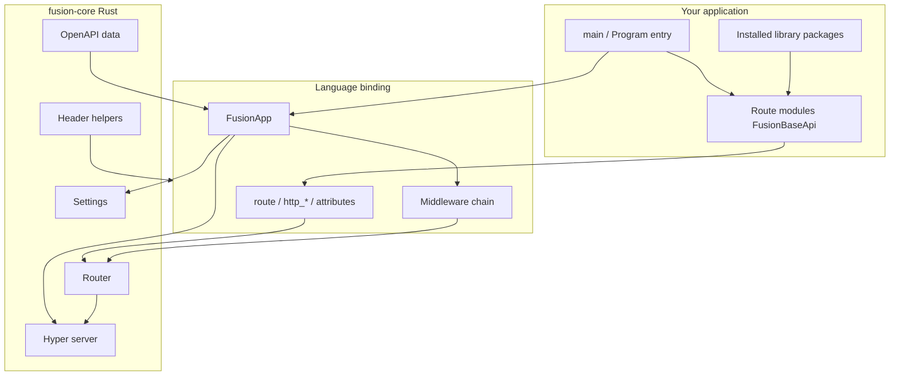

## Что такое Fusion

**Fusion Framework** — это классовый HTTP-фреймворк. Вы описываете API-модули как классы (подклассы `FusionBaseApi`), регистрируете их через route-декоратор или атрибут и запускаете `FusionApp`. Общее **Rust-ядро** (`fusion-core`) отвечает за HTTP-сервер, маршрутизацию, настройки, хелперы заголовков и сериализацию ответов. Языковые биндинги (Python, TypeScript/Node.js, C#) остаются тонкими и сосредоточены на удобстве разработки.

Текущая опубликованная версия пакетов фреймворка: **1.2.6** (см. репозиторий [fusion-framework](https://github.com/cipherunits/fusion-framework)).

## Философия проектирования

| Принцип | Что это значит на практике |
| --- | --- |
| Общее ядро | Токены путей, настройки, коды статуса и хелперы заголовков реализованы один раз в Rust |
| Классовые API | Обработчики живут на классах, а не в свободных функциях — модуль владеет поверхностью ресурса |
| Тонкие биндинги | Python / Node / C# повторяют ту же HTTP-семантику с идиоматичным синтаксисом |
| Явная регистрация | Импорт route-модуля (или вызов `Route.Register`) регистрирует его; магического автосканирования файловой системы нет |
| Компонуемые пакеты | Переиспользуемые библиотеки — обычные пакеты, устанавливаемые через Fusion Tool (`fusion add`) |

## Архитектура верхнего уровня

## Слои, с которыми вы работаете

| Слой | Ответственность |
| --- | --- |
| **Application** | `main.py` / entry-файл, JSON окружения, список middleware, импорт модулей |
| **Route module** | Класс `FusionBaseApi` с `@route` / `route()` / `[Route]` — владеет HTTP-обработчиками ресурса |
| **Library package** | Публикуемый пакет, созданный через `fusion module init` и установленный через `fusion add` — обычный импортируемый код, не особый тип runtime-плагина |
| **Binding** | Языкоспецифичный API поверх Rust-ядра |
| **fusion-core** | HTTP-сервер, роутер, настройки, naming-токены, fingerprints, сериализация |

## FMA (Fusion Module Architecture)

FMA — модель модульности Fusion: приложения собираются из **route-модулей** и опциональных **переиспользуемых пакетов**, с чёткой границей между HTTP-поверхностью и общими библиотеками.

→ Подробнее: [Fusion Module Architecture (FMA)](./fma)

## Путь обучения

1. [Чем Fusion не является](./what-fusion-is-not) — границы области (без ORM, без DI-контейнера, …)
2. [Workspace и crates](./workspace) — где живут ядро и биндинги
3. [Структура проекта](./project-structure) — что создаёт `fusion init`
4. **[Fusion Tool](../../cli/v1)** — scaffold приложений и окружений
5. Быстрый старт по языкам: [Python](../../python/v1/getting-started) · [TypeScript](../../typescript/v1/getting-started) · [C#](../../csharp/v1/getting-started)
6. [Route-модули приложения](./application-modules)
7. [Переиспользуемые пакеты](./packages) · [CLI Modules](../../cli/v1/modules)
8. [Жизненный цикл приложения](./lifecycle) · [Настройки и конфигурация](./settings) · [Жизненный цикл запроса](./request-lifecycle)
9. [Лучшие практики](./best-practices) · [Анти-паттерны](./anti-patterns)

## Связанные инструменты

- **[Fusion Tool](../../cli/v1)** — scaffold приложений, окружений, команд, пакетных модулей
- **[Fusion Desktop](https://fusion.cipherunit.xyz/en/gui)** — GUI для управления Fusion-бэкендами
