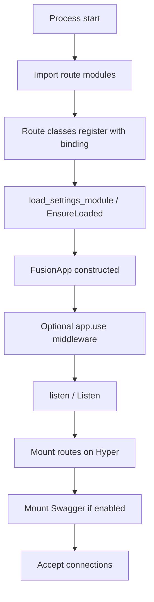
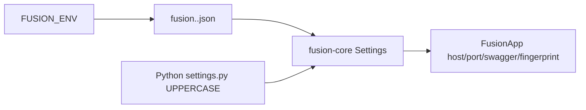

## Что это

**Жизненный цикл приложения** — упорядоченная последовательность шагов от запуска процесса до обслуживания HTTP-трафика.

## Последовательность старта

### Детали шагов

| Шаг | Что происходит |
| --- | --- |
| Import / register | Python/Node: декораторы срабатывают при импорте. C#: `Route.Register<T>()` |
| Settings | Загрузка `fusion.<env>.json` (`FUSION_ENV`, по умолчанию `dev`). Python может смержить UPPERCASE-атрибуты из `settings` / `core.settings` |
| `FusionApp` | Хранит настройки, список middleware, native handle движка |
| Middleware | Готовится глобальная цепочка (см. заметки биндинга про `framework_headers`) |
| `listen` | Биндинг монтирует зарегистрированные маршруты, опционально маршруты Swagger, биндит host/port, блокируется на обслуживании |

## Поток настроек

Если в JSON есть объект верхнего уровня `config` (стиль CLI scaffold), он мержится как настройки. Иначе мержатся ключи верхнего уровня (кроме `env` / `commands`).

## Завершение работы

`listen()` обычно блокирует процесс до его завершения. Отдельного документированного «graceful shutdown API» у Fusion нет — только обычные сигналы процесса. Обработку OS-сигналов считайте ответственностью приложения, если только биндинг не даёт dispose/`using` (в C# `FusionApp` реализует `IDisposable`).

## Далее

- [Настройки и конфигурация](./settings) — `fusion.<env>.json`, `FUSION_ENV`, overlays
- [Жизненный цикл запроса](./request-lifecycle)
- Config по языкам: [Python](../../python/v1/config) · [TypeScript](../../typescript/v1/config) · [C#](../../csharp/v1/config)
