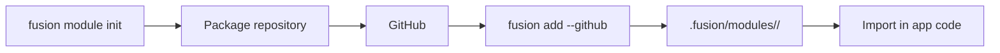

## Что это

**Library-пакет Fusion** (в CLI часто называют «module») — публикуемая библиотека с манифестом `fusion.module.toml`. Ставится в приложение через `fusion add` и подключается обычными языковыми импортами.

Он **не** монтируется автоматически как HTTP-маршруты.

## Зачем

Переиспользовать middleware-хелперы, валидаторы, клиенты или native-код в многих приложениях Fusion без копирования файлов.

## Как

Полный справочник CLI: [Modules](../../cli/v1/modules).



### Создание

```bash
fusion module init --lang python --name jwt --description "JWT helpers"
```

### Установка в приложение

Из проекта с `fusion-framework.toml`:

```bash
fusion add --github OWNER/fusion-jwt-mod@v1.0.0
```

### Использование

```python
from fusion_jwt_mod import some_helper
```

Вызывайте хелперы из route-модулей, middleware или на старте — как удобнее вашей архитектуре.

## Module приложения vs переиспользуемый пакет

| | Route module | Library package |
| --- | --- | --- |
| Живёт в | Репозитории приложения (`src/modules`) | Отдельном репозитории (рекомендуется) |
| Регистрирует HTTP-маршруты? | Да | Только если *вы* сами напишете код регистрации |
| Механизм установки | Git / исходники приложения | `fusion add` + import |
| Манифест | Не обязателен | `fusion.module.toml` |

## Лучшие практики

- Держите пакеты сфокусированными (одна ответственность)
- Документируйте публичные экспорты в README пакета
- Версионируйте тегами для `fusion add …@vX.Y.Z`
- Предпочитайте Rust-scaffolds, когда одно native-ядро должно обслуживать хосты Python и Node

## См. также

- [FMA](./fma)
- [CLI Modules](../../cli/v1/modules)
