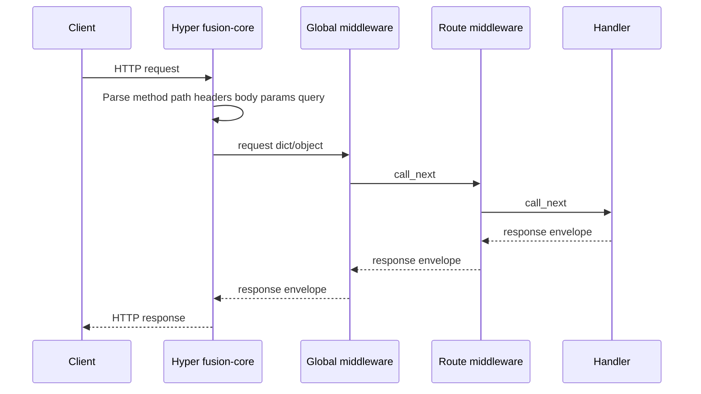

## Конвейер



## Поля запроса

| Поле | Значение |
| --- | --- |
| `method` | HTTP-глагол |
| `path` | Путь запроса |
| `headers` | Карта заголовков |
| `body` | Сырое тело как строка |
| `params` | Параметры пути |
| `query` | Карта query string |
| `state` | Изменяемый bag для middleware (например JWT) |

## Конверт ответа

Handlers возвращают (или middleware прерывает цепочку) объект вида:

```json
{ "status": 200, "body": { }, "headers": { } }
```

Используйте хелперы `self.response(...)` / `Response(...)`. Нестроковые тела при необходимости сериализуются в JSON ядром.

## Порядок middleware

1. Глобальный middleware, зарегистрированный на `FusionApp` (внешний первым)
2. Route middleware из `@route(..., middleware=...)` / `roles=...`
3. Handler

Возврат `{ "status": …, "body": … }` останавливает цепочку.

## Parameter binding в Python

Только в Python **параметры сигнатуры** handler заполняются из path → body (для write-методов) → query. Это **не** контейнер dependency injection. В Node и C# поля `params` / `query` / `body` доступны на объекте запроса.

## Fingerprint-заголовки

При включении Fusion может добавить заголовки идентичности вроде `X-Powered-By`, `X-Framework` и `X-Fusion-Version` (слой middleware и/или сервера — зависит от биндинга и `fingerprint.enabled`). См. гайды middleware по языкам.
