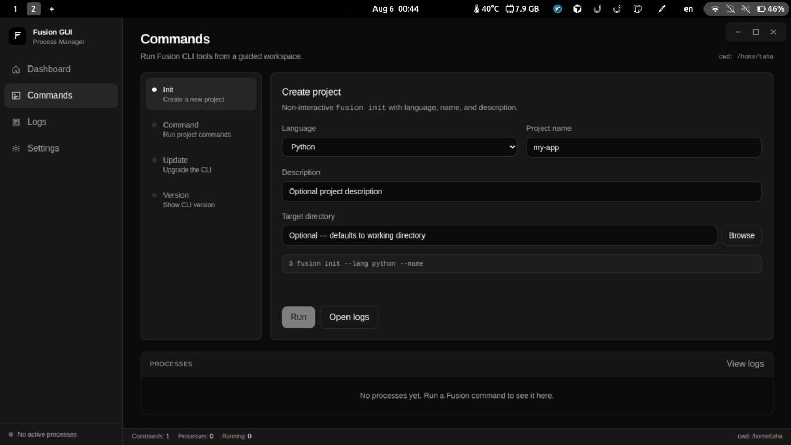

# Что такое Fusion Tool?

**Fusion Tool** — официальный CLI для **Fusion Framework**. Имя бинарника — `fusion` (crate `fusion-tool`).

Им можно скаффолдить проекты, управлять конфигами окружений, запускать команды проекта, создавать и устанавливать библиотечные пакеты и обновлять сам CLI — одним бинарником на Linux, macOS и Windows.

Текущая версия CLI: **1.2.6**. Скаффолденные приложения пинят пакет фреймворка на версию, зашитую в CLI (сейчас **1.2.3** в сгенерированных файлах зависимостей).

С Fusion Tool вы можете:

- Создавать новые проекты Fusion Framework (`fusion init`)
- Запускать команды проекта по окружениям (`fusion command`)
- Скаффолдить публикуемые библиотечные пакеты (`fusion module init`)
- Устанавливать модули с GitHub в приложение (`fusion add`)
- Обновлять CLI на месте (`fusion update`)

## Команды одним взглядом

| Команда | Назначение |
| --- | --- |
| `fusion init` | Скаффолд нового проекта |
| `fusion command <name>` | Запуск команды из `fusion.<env>.json` |
| `fusion module init` | Создание публикуемого библиотечного пакета |
| `fusion add --github …` | Установка модуля в текущий проект |
| `fusion update` | Обновление до последнего релиза |
| `fusion --version` | Версия установленного CLI |

См. [Начало работы](./getting-started), [Команды](./command), [Модули](./modules) (скаффолды по языкам), [Fusion Desktop](./desktop) и [сниппеты VS Code](./vscode).

## Fusion Desktop

Подробнее: [**документация Fusion Desktop**](./desktop). Сборки: [**/ru/gui**](/ru/gui).

Fusion Desktop доступен для **Windows и Linux**, с установщиками и сборками под распространённые архитектуры. Разработка: [Cipher Unit](https://cipherunit.xyz).

[Скачать Fusion Desktop](/ru/gui)
