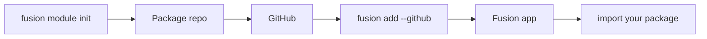

## Обзор

**Модули** Fusion — это публикуемые библиотечные пакеты, а не плагины маршрутов.
Вы пишете обычный пакет (Python, TypeScript или Rust), пушите на GitHub, затем ставите его в приложение Fusion через CLI. После этого импортируете как любую другую зависимость.



## Рекомендуемые имена

Именование **рекомендуется**, но не обязательно. Его можно переопределить в `fusion.module.toml`.

| Хост | Шаблон | Пример (`--name jwt`) |
| --- | --- | --- |
| Python | `fusion_<name>_mod` | `fusion_jwt_mod` → `from fusion_jwt_mod import ...` |
| npm / TypeScript | `fusion-<name>-mod` | `fusion-jwt-mod` → `import { ... } from "fusion-jwt-mod"` |

Репозиторий / папка по умолчанию: `fusion-<name>-mod`.

## Создание модуля

```bash
fusion module init
```

Интерактивные вопросы:

1. Язык реализации — **Python**, **TypeScript**, **C#** или **Rust**
2. Имя модуля (id)
3. Описание
4. Выходная директория (интерактивный дефолт `fusion-{id}-mod`)

Без интерактива:

```bash
fusion module init --lang python --name example --description "My first module"
fusion module init --lang csharp --name helpers --description "Shared helpers"
fusion module init --lang rust --name auth --description "Auth helpers" ./fusion-auth-mod
```

### Языки

| Язык | Что получаете |
| --- | --- |
| **Python** | Чистый Python-пакет в `python/fusion_<name>_mod/` |
| **TypeScript** | npm-пакет с `js/` + `src/` |
| **C#** | .NET library-пакет (стиль `Fusion<Name>Mod`) |
| **Rust** | Общий Rust-core + опциональные хосты **PyO3**, **N-API** и **C#** |

Rust удобен, когда нужен один нативный core для нескольких языков-хостов. Неинтерактивный `--lang rust` включает все три хоста; в интерактиве можно выбрать несколько.

### Структура скаффолда (Python)

```text
fusion-example-mod/
├── fusion.module.toml
├── pyproject.toml
├── README.md
└── python/
    └── fusion_example_mod/
        ├── __init__.py
        └── hello.py
```

В скаффолде есть небольшой пример `hello()`. Замените его своим API.


## Что создаёт скаффолд для каждого языка

### Python (`--lang python`)

Создаёт **чистый Python**-пакет, который можно установить:

```text
fusion-<id>-mod/
├── fusion.module.toml
├── pyproject.toml          # setuptools, package under python/
├── README.md
├── .gitignore
└── python/
    └── fusion_<id>_mod/
        ├── __init__.py     # exports hello()
        └── hello.py
```

- Имя пакета: `fusion_<id>_mod` (подчёркивания)
- Сборка при `fusion add`: `pip install -e .`
- Хост: только Python-приложения
- Вы заменяете `hello()` публичным API; приложения делают `from fusion_<id>_mod import …`

### TypeScript (`--lang typescript`)

Создаёт **npm**-пакет: TypeScript-исходники компилируются в `js/`:

```text
fusion-<id>-mod/
├── fusion.module.toml
├── package.json            # name: fusion-<id>-mod, build: tsc
├── tsconfig.json
├── src/index.ts            # hello()
├── js/index.js + index.d.ts
├── README.md
└── .gitignore
```

- Имя пакета: `fusion-<id>-mod`
- Сборка: `npm install && npm run build`
- Хост: TypeScript/Node Fusion-приложения
- После `fusion add` CLI линкует `file:.fusion/modules/<id>` в `package.json` приложения

### C# (`--lang csharp`)

Создаёт **.NET class library** (`net10.0`):

```text
fusion-<id>-mod/
├── fusion.module.toml
├── Fusion<Name>Mod/
│   ├── Fusion<Name>Mod.csproj
│   └── Module.cs           # Module.Hello()
├── README.md
└── .gitignore
```

- Пакет / assembly: `Fusion<Name>Mod` (PascalCase из id)
- Сборка: `dotnet build -c Release …`
- Хост: C# Fusion-приложения
- После `fusion add` CLI делает `dotnet add reference` на vendored `.csproj`

### Rust (`--lang rust`)

Создаёт **Cargo workspace** с общим Rust-core и опциональными привязками хостов:

```text
fusion-<id>-mod/
├── fusion.module.toml
├── Cargo.toml              # workspace
├── crates/core/            # shared Rust library (hello)
├── bindings/python/        # optional PyO3 (if Python target selected)
├── bindings/node/          # optional N-API (if TypeScript target selected)
├── bindings/csharp/        # optional P/Invoke wrapper (if C# target selected)
├── README.md
└── .gitignore
```

- Интерактивный режим: multi-select хостов (Python / TypeScript / C#)
- Неинтерактивный `--lang rust`: по умолчанию **все три** хоста
- Сборка: `cargo build --release` плюс шаги по хостам (`maturin`, `npm run build`, `dotnet build`) из `fusion.module.toml`
- Выбирайте Rust, когда одна нативная реализация должна обслуживать несколько языковых хостов

## После скаффолда — публикация и установка

1. Реализуйте API (замените `hello` / `Module.Hello`)
2. Запушьте на GitHub и поставьте теги версий (`v1.0.0`)
3. В каталоге Fusion-**приложения**: `fusion add --github OWNER/REPO@v1.0.0`
4. Импортируйте пакет в route-модулях / middleware — **маршруты сами не монтируются**

## Важные поля `fusion.module.toml`

| Секция | Назначение |
| --- | --- |
| `[module]` | `id`, `name`, `version`, `description` |
| `[module.impl]` | `language` = `python` \| `typescript` \| `csharp` \| `rust` |
| `[module.targets]` | Какие хост-приложения могут ставить этот модуль |
| `[module.entry]` | Имена import / пакета по хостам |
| `[module.build]` | Shell-команды, которые `fusion add` запускает после vendor |

Правила id: строчные буквы, цифры, дефисы; должен начинаться с буквы.

## Манифест

У каждого модуля есть `fusion.module.toml`:

```toml
[module]
id = "example"
name = "example"
version = "0.1.0"
description = "My first module"

[module.impl]
language = "python"

[module.targets]
python = true
typescript = false

[module.entry]
python = "fusion_example_mod"

[module.build]
python = "pip install -e ."
```

- **`entry`** — имя import-пакета (или npm-имя для TypeScript)
- **`build`** — команды, которые `fusion add` выполняет после скачивания
- **`targets`** — какие языки хост-приложений поддерживает модуль

## Публикация

1. Реализуйте пакет
2. Закоммитьте и запушьте на GitHub
3. Из Fusion-приложения выполните `fusion add`

## Установка в приложение

Запускайте из проекта, где уже есть `fusion-framework.toml`:

```bash
fusion add --github cipherunits/hello-fusion
fusion add --github OWNER/fusion-example-mod@v1.0.0
fusion add --github https://github.com/OWNER/fusion-example-mod
```

CLI сделает следующее:

1. Скачает репозиторий
2. Проверит `fusion.module.toml`
3. Положит его в `.fusion/modules/<id>/`
4. Выполнит объявленные шаги сборки / установки (`pip install -e .`, `maturin` или `npm`)
5. Запишет модуль в `fusion-framework.toml` в `[[modules]]`
6. Для TypeScript-хостов слинкует пакет в `package.json`

## Использование в приложении

Python:

```python
from fusion_example_mod import hello

print(hello("world"))
```

TypeScript:

```ts
import { hello } from "fusion-example-mod";

console.log(hello("world"));
```

Вызывайте функции из routes, сервисов или любого другого места Fusion-приложения — модули это обычные библиотеки.
