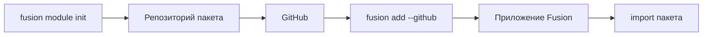

## Overview

**Модули** Fusion — это публикуемые библиотечные пакеты, а не плагины маршрутов.
Вы пишете обычный пакет (Python, TypeScript или Rust), публикуете его на GitHub и устанавливаете в приложение Fusion через CLI. После этого импортируете его как любую другую зависимость.



## Рекомендуемое именование

Именование **рекомендуется**, но не обязательно. Его можно переопределить в `fusion.module.toml`.

| Host | Шаблон | Пример (`--name jwt`) |
| --- | --- | --- |
| Python | `fusion_<name>_mod` | `fusion_jwt_mod` → `from fusion_jwt_mod import ...` |
| npm / TypeScript | `fusion-<name>-mod` | `fusion-jwt-mod` → `import { ... } from "fusion-jwt-mod"` |

Репозиторий / папка по умолчанию: `fusion-<name>-mod`.

## Создание модуля

```bash
fusion module init
```

В интерактивном режиме CLI спросит:

1. Язык реализации — **Python**, **TypeScript** или **Rust**
2. Имя модуля (id)
3. Описание
4. Выходную директорию (по умолчанию `fusion-<id>-mod`)

Неинтерактивно:

```bash
fusion module init --lang python --name example --description "My first module"
fusion module init --lang rust --name auth --description "Auth helpers" ./fusion-auth-mod
```

### Языки

| Язык | Результат |
| --- | --- |
| **Python** | Чистый Python-пакет в `python/fusion_<name>_mod/` |
| **TypeScript** | npm-пакет с `js/` и `src/` |
| **Rust** | Общее Rust-ядро + опциональные биндинги **PyO3** и **N-API** для Python и TypeScript |

Rust удобен, когда нужно одно native-ядро для всех host-языков.

### Структура scaffold (Python)

```text
fusion-example-mod/
├── fusion.module.toml
├── pyproject.toml
├── README.md
└── python/
    └── fusion_example_mod/
        ├── __init__.py
        └── hello.py
```

В scaffold есть пример `hello()`. Замените его своим API.

## Manifest

У каждого модуля есть `fusion.module.toml`:

```toml
[module]
id = "example"
name = "example"
version = "0.1.0"
description = "My first module"

[module.impl]
language = "python"

[module.targets]
python = true
typescript = false

[module.entry]
python = "fusion_example_mod"

[module.build]
python = "pip install -e ."
```

- **`entry`** — имя пакета для import (или npm-имя для TypeScript)
- **`build`** — команды, которые `fusion add` запускает после загрузки
- **`targets`** — какие host-языки поддерживает модуль

## Публикация

1. Реализуйте пакет
2. Запушьте на GitHub
3. В приложении Fusion выполните `fusion add`

## Установка в приложение

Запускайте из проекта с `fusion-framework.toml`:

```bash
fusion add --github OWNER/fusion-example-mod
fusion add --github OWNER/fusion-example-mod@v1.0.0
fusion add --github https://github.com/OWNER/fusion-example-mod
```

CLI делает следующее:

1. Скачивает репозиторий
2. Проверяет `fusion.module.toml`
3. Кладёт пакет в `.fusion/modules/<id>/`
4. Запускает build / install (`pip install -e .`, `maturin` или `npm`)
5. Записывает модуль в `fusion-framework.toml` в `[[modules]]`
6. Для TypeScript-host также линкует пакет в `package.json`

## Использование в приложении

Python:

```python
from fusion_example_mod import hello

print(hello("world"))
```

TypeScript:

```ts
import { hello } from "fusion-example-mod";

console.log(hello("world"));
```

Вызывайте функции из маршрутов, сервисов или любого другого места — модули это обычные библиотеки.
