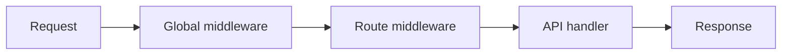

## Обзор

Middleware оборачивает каждый запрос (или один маршрут) так:

```text
(request, call_next) → response | call_next(request)
```

**В Fusion нет middleware по умолчанию.** Ничего не выполняется, пока вы сами не зарегистрируете callable — обычно в `main.py`.

Хелперы вроде `bearer_jwt` / `require_roles` — опциональные утилиты. Их нужно `app.use(...)` или передать в `@route` самостоятельно.

## Два слоя



1. **Глобальный** — на `FusionApp` через `app.use(...)` (из `MIDDLEWARE` в `main.py`)
2. **Route** — через `middleware=[...]` или `roles=[...]` на `@route`

Порядок: сначала глобальный список (снаружи → внутрь), затем список route, затем хендлер.

## Регистрация в `main.py`

```python
"""Entry point: register routes, middleware, and start the server."""

import src.modules.products.products  # registers @route classes

from fusion_framework.app import FusionApp
from fusion_framework.config import get_settings, load_settings_module

# Global middleware (optional). Framework ships with none by default.
MIDDLEWARE: list = []


def main() -> None:
    load_settings_module("settings")
    app = FusionApp(get_settings())
    for middleware in MIDDLEWARE:
        app.use(middleware)
    app.listen()


if __name__ == "__main__":
    main()
```

Добавьте функции в `MIDDLEWARE`:

```python
def logging_middleware(request, call_next):
    print(request["method"], request["path"])
    return call_next(request)

MIDDLEWARE = [logging_middleware]
```

## Простой middleware

```python
def require_api_key(request, call_next):
    key = (request.get("headers") or {}).get("x-api-key")
    if key != "secret":
        return {"status": 401, "body": {"detail": "invalid api key"}}
    return call_next(request)
```

| Действие | Как |
| --- | --- |
| Продолжить | `return call_next(request)` |
| Остановиться рано | `return {"status": 401, "body": {...}}` |
| Поделиться данными | `request.setdefault("state", {})["user"] = ...` затем `call_next` |

В хендлере читайте state через `self.state`:

```python
def get(self):
    user = self.state.get("user")
    return self.response({"user": user})
```

## Middleware на уровне route

```python
from fusion_framework.route import route

def only_post(request, call_next):
    if request.get("method", "").upper() != "POST":
        return {"status": 405, "body": {"detail": "POST only"}}
    return call_next(request)

@route("api/[module]/", middleware=[only_post])
class UploadModule(FusionBaseApi):
    def post(self):
        return self.response({"ok": True})
```

## Опциональные хелперы

Они **не** включаются автоматически.

### `bearer_jwt()`

Читает `Authorization: Bearer …`, декодирует payload JWT (по умолчанию: **неверифицированный** base64 decode — для production передайте `verify=`), кладёт в `request["state"]["jwt"]`.

```python
from fusion_framework import bearer_jwt

MIDDLEWARE = [bearer_jwt()]
# or with your verifier:
# MIDDLEWARE = [bearer_jwt(verify=my_verify_fn)]
```

### `require_roles(...)` / `@route(..., roles=[...])`

Ожидает payload уже в `state["jwt"]` с claim `roles`.

```python
@route("api/admin", roles=["admin", "super_admin"])
class AdminModule(FusionBaseApi):
    def get(self):
        return self.response({"ok": True})
```

Эквивалент:

```python
from fusion_framework.middleware import require_roles

@route("api/admin", middleware=[require_roles("admin", "super_admin")])
```

Нет auth → `401`. Неверная роль → `403`.

## Async middleware

Используйте `async def` и `await call_next(request)`:

```python
import asyncio

async def slow_check(request, call_next):
    await asyncio.sleep(0.01)
    return await call_next(request)

MIDDLEWARE = [slow_check]
```

Можно смешивать sync и async middleware в одном списке. См. [Async](./async).

## Форма request

`request` — обычный dict (та же форма, что ядро передаёт хендлерам):

| Ключ | Содержимое |
| --- | --- |
| `method` | HTTP-метод |
| `path` | Путь |
| `headers` | Карта заголовков |
| `body` | Сырое тело строкой |
| `params` | Path-параметры |
| `query` | Карта query |
| `state` | Изменяемый bag для middleware → хендлер |

## Правила на память

- Фреймворк никогда не регистрирует middleware за вас  
- Глобальный middleware — в `main.py` → `MIDDLEWARE` → `app.use`  
- Auth / scoping — рядом с маршрутом через `middleware=` или `roles=`  
- Short-circuit через status envelope; иначе всегда вызывайте `call_next`
